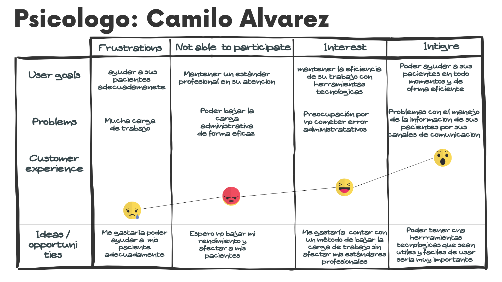
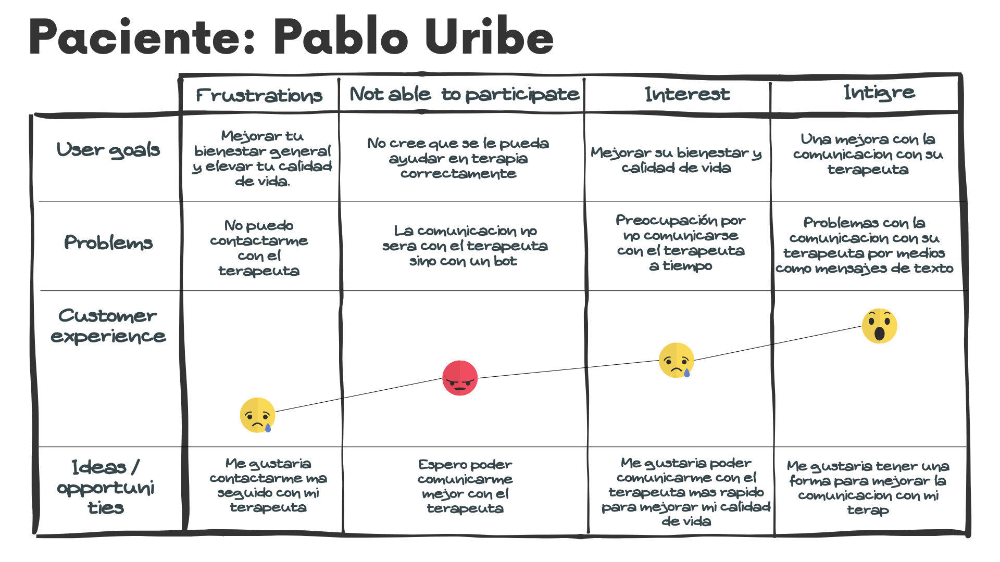
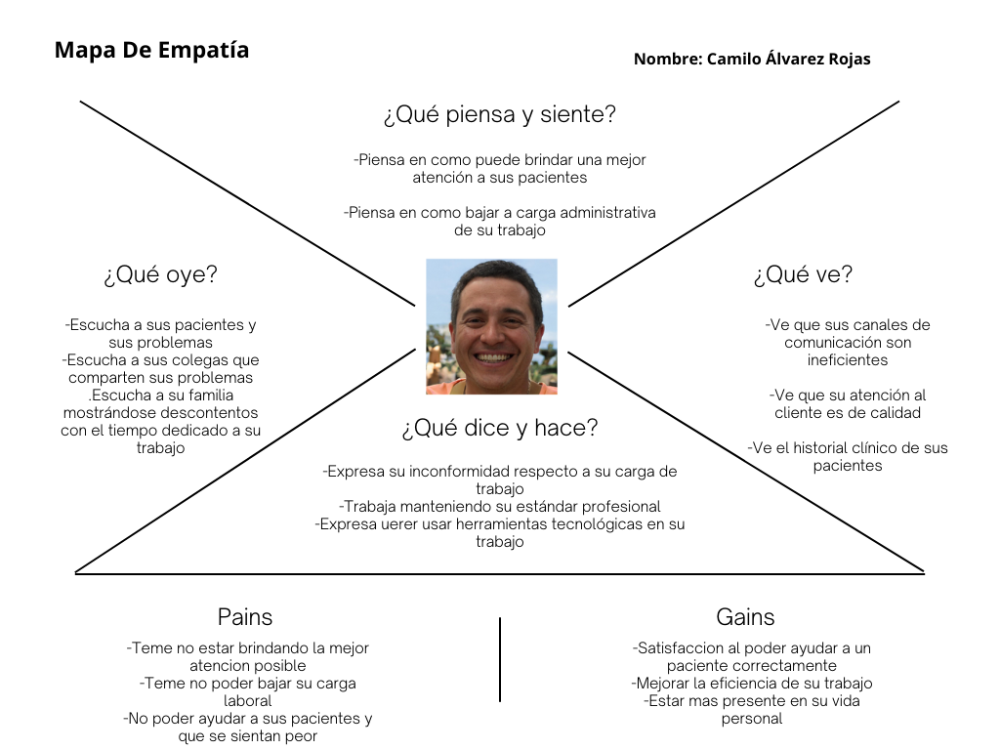
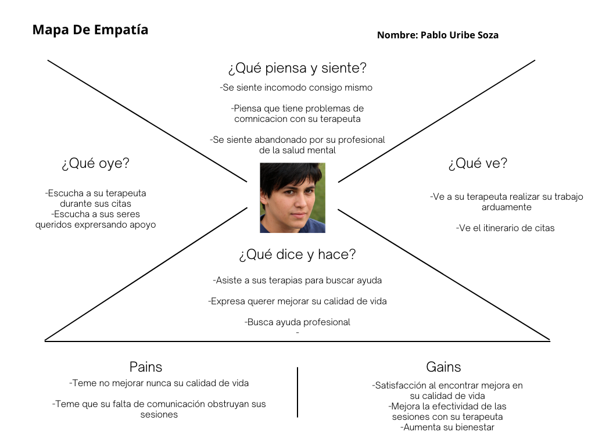

## **User Task Matrix**

En esta sección se presenta el **User Task Matrix**, que concentra las tareas que los User Persona (que representan a cada segmento) realizan para cumplir sus objetivos. No se deben confundir tareas (tasks) con opciones o características de software, pues las tareas deben ser realizadas por los segmentos independientemente de la existencia de la solución de software.

### **Segmento 1: Médicos de la salud mental**

| Tareas                                                | Médicos de la salud mental/ Importancia | Médicos de la salud mental/ Frecuencia |
|-------------------------------------------------------|----------------------------------------|----------------------------------------|
| Gestión y actualización de historias clínicas         | Alta                                   | Siempre                                |
| Programación y gestión de citas                       | Alta                                   | Siempre                                |
| Comunicación con otros profesionales de la salud      | Media                                  | A veces                                |
| Registro de notas de sesiones                         | Alta                                   | Siempre                                |
| Acceso a la información médica relevante              | Alta                                   | Siempre                                |
| Revisión de tratamientos y planes terapéuticos        | Alta                                   | A veces                                |
| Generación de reportes clínicos                       | Media                                  | A veces                                |
| Coordinación de reuniones de equipo multidisciplinario| Media                                  | Nunca                                  |

### **Segmento 2: Pacientes**

| Tareas                                                | Pacientes/ Importancia                 | Pacientes/ Frecuencia                  |
|-------------------------------------------------------|----------------------------------------|----------------------------------------|
| Agendar y gestionar citas                             | Alta                                   | A veces                                |
| Acceso a información sobre tratamientos               | Alta                                   | A veces                                |
| Comunicación con el médico                            | Alta                                   | A veces                                |
| Seguimiento de citas y recordatorios                  | Alta                                   | Siempre                                |
| Acceso a sus propios registros clínicos               | Media                                  | A veces                                |
| Participación en encuestas de seguimiento de salud    | Media                                  | Nunca                                  |
| Revisión de facturas y pagos                          | Media                                  | Nunca                                  |

---

### **Análisis de la Matriz**

En la matriz presentada, se pueden observar las siguientes tareas con mayor frecuencia e importancia:

- **Médicos de la salud mental**:
  - La gestión y actualización de historias clínicas, la programación y gestión de citas, el registro de notas de sesiones, y el acceso a la información médica relevante se destacan por su alta importancia y su frecuencia "Siempre", ya que son esenciales para el desempeño diario de los profesionales.
  - La generación de reportes clínicos y la coordinación de reuniones de equipo multidisciplinario, aunque importantes, tienen una frecuencia menor, ya que estas tareas no son realizadas de manera continua.

- **Pacientes**:
  - Las tareas de agendar y gestionar citas, el seguimiento de citas y recordatorios, y la comunicación con el médico, aunque de alta importancia, varían en frecuencia, con algunas realizadas "Siempre" y otras "A veces". 
  - Otras tareas, como la participación en encuestas de seguimiento de salud y la revisión de facturas y pagos, tienen una frecuencia "Nunca", lo que refleja su menor impacto en el día a día de los pacientes.

Las coincidencias entre los segmentos destacan la importancia de una solución integrada que facilite la gestión tanto para médicos como para pacientes. Las principales diferencias se reflejan en la naturaleza de las tareas, donde los médicos tienen un enfoque más administrativo y clínico, mientras que los pacientes se centran en la gestión personal de su atención médica.

## **User Journey Mapping**

El User Journey Mapping se desarrolló para comprender la experiencia de los usuarios al interactuar con nuestra plataforma. Este mapeo detalla cada paso que el usuario realiza, los obstáculos que puede encontrar, y las emociones que surgen en el proceso. Así, nos ayuda a identificar oportunidades para mejorar la usabilidad y satisfacción del usuario.

### **Segmento 1: Medicos de la salud mental**

### **Segmento 2: Pacientes**

## **Emphaty Mapping**

Para la creación del Empathy Map, hemos utilizado la información obtenida de nuestros dos User Personas que representan nuestro segmento objetivo. Este mapa nos permite profundizar en la comprensión de las necesidades, pensamientos, emociones y comportamientos de los usuarios, ayudándonos a diseñar soluciones más alineadas con sus expectativas y experiencias reales.

### **Segmento 1: Medicos de la salud mental**

### **Segmento 2: Pacientes**
