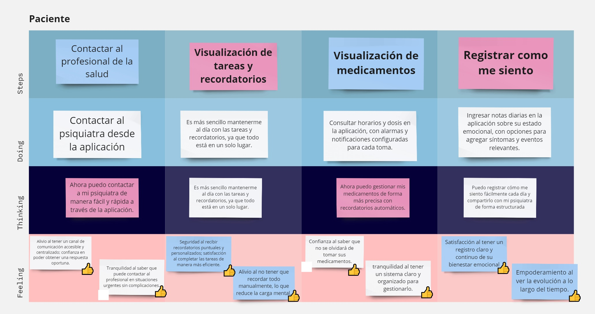

# CAPÍTULO III: Requirements Specifications

## 3.1. To-Be Scenario Mapping.
### Segmento Profesionales:

### Segmento Pacientes:

## 3.2. User Stories.

| ID   | Título                                                                     | Descripción                                                                                                                                                                                             | Criterios de aceptación                                                                                                                                                                                                                                                                                                                                                                                                                                                                                                                                                                                                                                                                                                                                                                                                                                                                                                                                                                                  | EpicID |
|------|----------------------------------------------------------------------------|---------------------------------------------------------------------------------------------------------------------------------------------------------------------------------------------------------|----------------------------------------------------------------------------------------------------------------------------------------------------------------------------------------------------------------------------------------------------------------------------------------------------------------------------------------------------------------------------------------------------------------------------------------------------------------------------------------------------------------------------------------------------------------------------------------------------------------------------------------------------------------------------------------------------------------------------------------------------------------------------------------------------------------------------------------------------------------------------------------------------------------------------------------------------------------------------------------------------------|--------|
| US01 | Adaptabilidad y compatibilidad de la Landing Page                          | Como visitante de la Landing Page, quiero que el contenido se adapte al tamaño de la pantalla del dispositivo desde el que accede para obtener la información de manera ordenada.                       | Scenario 1: Adaptabilidad a diferentes tamaños de pantalla Given el visitante se encuentra en la landing page, When ingresa al sitio web, Then la landing page muestra un contenido que se ajuste automáticamente al tamaño de la pantalla. Scenario 2: Compatibilidad con navegadores principales Given el visitante se encuentra en la landing page, When utiliza su navegador de preferencia, Then la landing page es compatible, muestra correctamente todos los elementos de diseño y funcionalidad.                                                                                                                                                                                                                                                                                                                                                                                                                                                                           | 1      |
| US02 | Encontrar información del propósito de la aplicación                       | Como visitante de la Landing Page, quiero encontrar fácilmente la información que explique el propósito de la aplicación para comprender cómo puede ser útil para mí.                                   | Scenario 1: Visibilidad del propósito de la aplicación Given el visitante se encuentra en la landing page, When explora la página principal,  Then la landing page muestra información clara y concisa de entender para el visitante. Scenario 2: Acceso rápido a los planes de la aplicación Given el visitante se encuentra en la sección de planes de la landing page, When selecciona el botón de “Más información”, Then la landing page direcciona a una sección que detalle las características y precios del plan seleccionado.                                                                                                                                                                                                                                                                                                                                                                                                                                             | 1      |
| US03 | Visualización de imágenes y gráficos relevantes                            | Como visitante de la Landing Page, quiero que las imágenes y gráficos sean claros y visualmente atractivos para captar mi interés y comprender mejor el contenido.                                      | Scenario 1: Calidad de las imágenes Given el visitante se encuentra en la landing page, When explora la página principal Then la landing page presenta imágenes de alta calidad y relevantes que capten la atención del visitante Scenario 2: Relevancia de los gráficos Given el visitante se encuentra en la landing page,  When se desplaza a través de la página Then la landing page debe mostrar gráficos que ayuden al visitante a comprender el contenido.                                                                                                                                                                                                                                                                                                                                                                                                                                                                                                                  | 2      |
| US04 | Tipografía cómoda y agradable estéticamente                                | Como visitante de la Landing Page, quiero que la tipografía de la misma sea legible y estéticamente agradable para facilitar la lectura y la navegación.                                                | Scenario 1: Legibilidad de la tipografía Given el visitante se encuentra en la landing page, When se desplaza a través de la página principal,  Then la landing page posee una tipografía clara y de un tamaño adecuado para facilitar la lectura. Escenario 2: Consistencia en el estilo tipográfico Given el visitante se encuentra en la landing page, When cambia de sección, Then la landing page muestra un estilo tipográfico consistente para mantener la coherencia visual.                                                                                                                                                                                                                                                                                                                                                                                                                                                                                                | 2      |
| US05 | Registro como profesional de la salud mental                               | Como profesional de la salud mental quiero registrarme con mis credenciales para poder acceder a las funcionalidades específicas y gestionar la información de mis pacientes.                           | Scenario 1: Registro de datos exitoso Given el profesional de la salud mental ha completado todos los campos del formulario de registro, When selecciona el botón ""Crear cuenta"", Then la cuenta se crea,  And el profesional accede a la aplicación con el rol de profesional de la salud mental. Scenario 2: Registro de datos incompleto Given el profesional de la salud mental no ha completado todos los campos del formulario de registro, When selecciona el botón ""Crear cuent"",a Then la plataforma muestra un mensaje de error indicando qué campos faltan por completar. Scenario 3: Registro con credenciales ya utilizadas Given el profesional de la salud mental ha completado todos los campos del formulario de registro usando un correo ya registrado, When selecciona el botón ""Crear cuenta"", Then la plataforma muestra un mensaje de error indicando que el correo electrónico ya está en uso  And sugiere recuperar la contraseña. | 3      |
| US06 | Inicio de sesión como pacientes                                            | Como paciente, quiero iniciar sesión en la plataforma para acceder a mi información personal y seguimiento de tratamiento.                                                                              | Scenario 1: Inicio de sesión exitoso Given el paciente ha ingresado su correo electrónico y contraseña correctamente, When selecciona el botón de ""Iniciar sesión"", Then accede a su cuenta  And es dirigido a su panel de control personal con el rol de paciente. Scenario 2: Contraseña incorrecta Given el paciente ha ingresado su correo y una contraseña incorrecta, When selecciona el botón de ""Iniciar sesión"", Then la plataforma muestra un mensaje de error indicando que la contraseña es incorrecta  And ofrece la opción de restablecerla. Scenario 3: Recuperación de contraseña Given el paciente ha olvidado su contraseña, When selecciona el botón de ""Olvidé mi contraseña"", Then la plataforma envía un enlace de restablecimiento de contraseña al correo electrónico registrado.                                                                                                                                                   | 3      |
| US07 | Inicio de sesión como profesional de la salud mental                       | Como profesional de la salud mental, quiero iniciar sesión en la plataforma para gestionar la información de mis pacientes y acceder a herramientas de seguimiento.                                     | Scenario 1: Inicio de sesión exitoso Given profesional de la salud mental ha ingresado su correo electrónico y contraseña correctamente, When selecciona el botón de ""Iniciar sesión"", Then accede a su cuenta And es dirigido a su panel de control con acceso a herramientas avanzadas de gestión de pacientes y el rol de profesional de la salud. Scenario 2: Contraseña incorrecta Given el profesional de la salud mental ha ingresado su correo y una contraseña incorrecta, When selecciona el botón de ""Iniciar sesión"", Then la plataforma muestra un mensaje de error indicando que la contraseña es incorrecta And ofrece la opción de restablecerla. Scenario 3: Recuperación de contraseña Given el profesional de la salud mental ha olvidado su contraseña, When selecciona el botón de ""Olvidé mi contraseña"", Then la plataforma envía un enlace de restablecimiento de contraseña al correo electrónico registrado.                      | 3      |
| US08 | Registro de información personal del paciente                              | Como profesional de la salud mental, quiero registrar la información personal del paciente para tener una referencia detallada y precisa de sus datos básicos en cada consulta.                         | Scenario 1: Registro exitoso de información personal Given el profesional de la salud mental ha ingresado todos los datos del formulario de información personal del paciente, When selecciona el botón de ""Guardar"", Then la información personal del paciente se registra correctamente en la plataforma y está disponible para futuras consultas. Scenario 2: Registro incompleto de información personal Given el profesional de la salud mental no ha ingresado todos los datos del formulario de información personal del paciente, When selecciona el botón de ""Guardar"", Then la plataforma muestra un mensaje de error indicando qué campos faltan por completar.                                                                                                                                                                                                                                                                                                      | 4      |
| US09 | Registro de medicamentos del paciente                                      | Como profesional de la salud mental, quiero registrar los medicamentos del paciente para seguir adecuadamente su tratamiento farmacológico.                                                             | Scenario 1: Registro exitoso de medicamentos Given el profesional de la salud mental ha ingresado todos los datos de los medicamentos de su paciente, When selecciona el botón de ""Guardar"", Then los datos del medicamento se registran correctamente en el sistema y se asocian al perfil del paciente. Scenario 2: Registro de medicamentos incompleto Given el profesional de la salud mental no ha ingresado todos los datos de los medicamentos de su paciente, When selecciona el botón de ""Guardar"", Then la plataforma muestra un mensaje de error indicando los campos incompletos o incorrectos.                                                                                                                                                                                                                                                                                                                                                                     | 4      |
| US10 | Registro de historial médico del paciente                                  | Como profesional de la salud mental, quiero registrar el historial médico del paciente para tener un contexto completo de sus antecedentes.                                                             | Scenario 1: Registro exitoso del historial previo Given el profesional de la salud mental ha introducido todos los datos del historial previo del paciente, When selecciona el botón de ""Guardar"", Then la plataforma registra correctamente el historial del paciente.                                                                                                                                                                                                                                                                                                                                                                                                                                                                                                                                                                                                                                                                                                                       | 4      |
| US11 | Visualizar datos estadísticos de funciones biológicas del paciente         | Como profesional de la salud mental, quiero visualizar estadísticas de las necesidades fisiológicas del paciente para evaluar su estado físico a lo largo del tratamiento.                              | Scenario 1: Visualización exitosa de datos estadísticos Given el profesional de la salud mental ha accedido al perfil del paciente, When Ingresa al perfil del paciente, Then la plataforma muestra los datos de manera clara, permitiendo una fácil interpretación.                                                                                                                                                                                                                                                                                                                                                                                                                                                                                                                                                                                                                                                                                                                            | 5      |
| US12 | Visualización de los estados de ánimo del paciente                         | Como profesional de la salud mental, quiero visualizar un registro de los estados de ánimo históricos del paciente para evaluar su progreso emocional.                                                  | Scenario 1: Visualización de estados de ánimo Given el profesional de la salud mental ha accedido al perfil del paciente, When selecciona la opción de visualizar estados de ánimo, Then la plataforma muestra los registros de los estados de ánimo del paciente en un formato gráfico o cronológico. Scenario 2: Estados de ánimo no registrados Given el profesional de la salud mental ha accedido al perfil del paciente sin haber registrado ningún estado de ánimo del mismo, When selecciona la opción de visualizar estados de ánimo, Then la plataforma muestra un mensaje de error mencionando que no hay datos registrados y sugiere registrar los estados de ánimo.                                                                                                                                                                                                                                                                                                    | 5      |
| US13 | Visualizar información del consumo de medicamentos del paciente            | Como profesional de la salud mental, quiero visualizar registros del cumplimiento del paciente con el consumo de la medicación asignada para asegurarse de que este sigue el tratamiento correctamente. | Scenario 1: Visualización exitosa del consumo de medicamentos Given el profesional de la salud mental ha accedido al perfil del paciente, When selecciona la opción de visualizar el consumo de medicamentos, Then la plataforma muestra una lista detallada con la información del cumplimiento del paciente con la medicación asignada.                                                                                                                                                                                                                                                                                                                                                                                                                                                                                                                                                                                                                                                       | 5      |
| US14 | Actualizar ingesta de pastillas                                            | Como profesional de la salud mental, quiero actualizar la prescripción del paciente para ajustar las dosis al tratamiento si es necesario.                                                              | Scenario 1: Actualización exitosa de ingesta de pastillas Given el profesional de la salud mental ha accedido al perfil del paciente And selecciona la opción para actualizar la ingesta de pastillas, When modifica los datos y selecciona el botón de ""Guardar"", Then la plataforma actualiza la información de la ingesta de pastillas en el sistema. Scenario 2: Actualización con datos incompletos o incorrectos Given el profesional de la salud mental ha accedido al perfil del paciente And selecciona la opción para actualizar la ingesta de pastillas, When modifica los datos, pero deja campos requeridos incompletos y selecciona el botón de “Guardar”, Then la plataforma muestra un mensaje de error indicando los campos que faltan completar antes de guardar.                                                                                                                                                                                         | 6      |
| US15 | Registro de apuntes por sesión                                             | Como profesional de la salud mental, quiero registrar apuntes de la sesión para no olvidar aspectos importantes                                                                                         | Scenario 1: Registro de apunte exitoso. Given el profesional de la salud mental llenó la información de su apunte. When selecciona el botón “Guardar” Then la plataforma guardar el apunte de acuerdo a la sesión                                                                                                                                                                                                                                                                                                                                                                                                                                                                                                                                                                                                                                                                                                                                                                               | 6      |
| US16 | Actualizar apuntes de la sesión terapéutica                                | Como profesional de la salud mental, quiero actualizar los apuntes de la sesión terapéutica para registrar cambios relevantes en el progreso del paciente relacionados a la sesión.                     | Scenario 1: Actualización exitosa de apuntes de la sesión Given el profesional de la salud mental ha accedido a los apuntes de la sesión terapéutica del paciente, When edita los apuntes y selecciona el botón de ""Guardar"", Then la plataforma actualiza los apuntes en la sesión seleccionada. Scenario 2: Error al actualizar apuntes de la sesión Given el profesional de la salud mental ha accedido a los apuntes de la sesión terapéutica del paciente, When edita los apuntes, pero deja campos importantes sin completar y selecciona el botón de “Guardar”, Then la plataforma muestra un mensaje de error indicando los campos que faltan completar antes de guardar.                                                                                                                                                                                                                                                                                                 | 6      |
| US17 | Actualizar diagnóstico del paciente                                        | Como profesional de la salud mental, quiero actualizar el diagnóstico del paciente para reflejar cambios en su condición, manteniendo así el diagnóstico alineado a la condición del paciente.          | Scenario 1: Actualización exitosa del diagnóstico Given el profesional de la salud mental ha accedido al diagnóstico actual del paciente, When edita el diagnóstico y selecciona el botón de ""Guardar"", Then la plataforma actualiza el nuevo diagnóstico del paciente, se notifica cualquier cambio importante y se guarda en el historial de diagnósticos.                                                                                                                                                                                                                                                                                                                                                                                                                                                                                                                                                                                                                                  | 6      |
| US18 | Recibir notificaciones de recordatorios de actividades                     | Como paciente, quiero recibir notificaciones en la plataforma para realizar actividades a las horas acordadas por mi médico.                                                                            | Scenario 1: Notificación para actividades en el horario programado Given el paciente se encuentra en el dashboard  And ha aceptado recibir notificaciones de la aplicación When llega la hora programada para realizar la actividad, Then la plataforma notifica al paciente, para que pueda atender a la actividad acordada.                                                                                                                                                                                                                                                                                                                                                                                                                                                                                                                                                                                                                                                                | 7      |
| US19 | Visualizar cambios en el dashboard                                         | Como paciente, quiero visualizar un apartado principal con la información relevante de mi tratamiento para estar siempre actualizado sobre el estado de mi tratamiento.                                 | Scenario 1: Visualización de la pantalla principal Given el paciente ha ingresado se encuentra en el dashboard de la aplicación  And la aplicación tiene datos recientes sobre el tratamiento del paciente, When el paciente accede al tablero principal de la aplicación, Then la plataforma muestra la información más relevante y actualizada de su tratamiento.                                                                                                                                                                                                                                                                                                                                                                                                                                                                                                                                                                                                                          | 7      |
| US20 | Recibir notificaciones cuando el terapeuta agregue o modifique información | Como paciente, quiero recibir notificaciones cuando el terapeuta actualice información para estar al tanto de las novedades en mi tratamiento.                                                          | Scenario 1:El paciente ingresa a la aplicación Given el paciente se encuentra el dashboard de la aplicación And ha aceptado recibir notificaciones de la aplicación  When el terapeuta guarda la nueva información en la plataforma, Then la plataforma notifica al paciente, informando sobre la nueva actualización en su tratamiento.                                                                                                                                                                                                                                                                                                                                                                                                                                                                                                                                                                                                                                                     | 7      |
| US21 | Registro de estado de ánimo                                                | Como paciente, quiero comunicarle a mi profesional mi estado de ánimo para ver el progreso de mi tratamiento.                                                                                           | Scenario 1: Registro de emoción. Given el paciente se encuentra en la sección de registros de estado emocional, When registra su estado de ánimo actual, Then la plataforma actualiza su estado emocional en el perfil del paciente. Scenario 2: Almacenamiento de estado de ánimo. Given el paciente se encuentra en la sección de registros de estado emocional, And posee un registro con cada uno de los estados que ingresó con anterioridad,  When ingresa al historial de estados de ánimo, Then la plataforma muestra un calendario con los estados del paciente a lo largo del tiempo.                                                                                                                                                                                                                                                                                                                                                                                  | 8      |
| US22 | Confirmación de consumo de pastillas                                       | Como paciente, quiero confirmar el consumo de mi medicamento para asegurarme de no olvidar ninguna dosis.                                                                                               | Scenario 1: Registro de consumo de medicamentos. Given el paciente accede a la aplicación  When accede a la sección de seguimiento de medicamentos, Then la plataforma mostrará los medicamentos que debe tomar el paciente And el paciente podrá confirmar su consumo. Scenario 2: Seguimiento de pastillas Given el paciente ha accedido a la sección de seguimiento de medicamentos, When accede al historial del mismo,  Then la plataforma muestra un calendario con los días que el paciente confirmó el consumo de sus medicamentos.                                                                                                                                                                                                                                                                                                                                                                                                                                      | 8      |
| US23 | Registro de funciones biológicas                                           | Como paciente, quiero registrar la calidad de mis funciones biológicas para poder ver mi progreso y que mi profesional a cargo también esté pendiente.                                                  | Scenario 1: Ingreso de funciones biológicas. Given el paciente ha accedido a la sección de registro de funciones biológicas, When selecciona la opción de registrar funciones, Then la plataforma permite al paciente seleccionar su nivel de sueño, hambre, energía e hidratación en una escala del 1 al 10.                                                                                                                                                                                                                                                                                                                                                                                                                                                                                                                                                                                                                                                                                   | 8      |
| US24 | Cambio de datos de acceso del paciente                                     | Como profesional de la salud mental, quiero actualizar los datos de acceso del paciente para asegurar que su información esté siempre correcta y refleje cualquier cambio necesario.                    | Scenario 1: Actualización exitosa de los datos de acceso Given el profesional de la salud mental ha accedido a la sección de cambio de datos de acceso del paciente, When actualiza los datos requeridos Y selecciona el botón de ""Guardar"", Then la plataforma actualiza los datos de acceso del paciente y muestra una confirmación de éxito. Scenario 2: Error al actualizar los datos de acceso por falta de completación Given el profesional de la salud mental ha accedido a la sección de cambio de datos de acceso del paciente, When intenta actualizar los datos pero deja campos obligatorios sin completar Y selecciona el botón de ""Guardar"", Then la plataforma muestra un mensaje de error indicando los campos que deben completarse para poder guardar los cambios.                                                                                                                                                                                     | 9      |
| US25 | Cambio de información personal del profesional de salud mental             | Como profesional de la salud mental, quiero actualizar mi información personal para mantener mis datos profesionales correctos y reflejar cualquier cambio relevante.                                   | Scenario 1: Actualización exitosa de la información personal Given el profesional de la salud mental ha accedido a la sección de cambio de información personal, When actualiza los datos requeridos Y selecciona el botón de ""Guardar"", Then la plataforma actualiza la información personal y muestra una confirmación de éxito. Scenario 2: Error al actualizar la información personal por falta de completación Given el profesional de la salud mental ha accedido a la sección de cambio de información personal, When intenta actualizar los datos pero deja campos obligatorios sin completar Y selecciona el botón de ""Guardar"", Then la plataforma muestra un mensaje de error indicando los campos que deben completarse para poder guardar los cambios.                                                                                                                                                                                                      | 9      |

## 3.3. Impact Mapping.
### Segmento profesionales:

### Segmento pacientes:

## 3.4 Product Backlog.

| **Orden** | **User Story / Technical Story Id** | **Título**                                           | **Descripción**                                                                                                                                                           | **Story Points (1 / 2 / 3 / 5 / 8)** |
|-----------|-------------------------------------|-----------------------------------------------------|---------------------------------------------------------------------------------------------------------------------------------------------------------------------------|--------------------------------------|
| 1         | US02                                | Encontrar información del propósito de la aplicación | Como visitante de la Landing Page, quiero encontrar fácilmente la información que explique el propósito de la aplicación para comprender cómo puede ser útil para mí.     | 2                                    |
| 2         | US03                                | Visualización de imágenes y gráficos relevantes      | Como visitante de la Landing Page, quiero que las imágenes y gráficos sean claros y visualmente atractivos para captar mi interés y comprender mejor el contenido.        | 1                                    |
| 3         | US04                                | Tipografía cómoda y agradable estéticamente         | Como visitante de la Landing Page, quiero que la tipografía de la misma sea legible y estéticamente agradable para facilitar la lectura y la navegación.                  | 1                                    |
| 4         | US01                                | Adaptabilidad y compatibilidad de la Landing Page   | Como visitante de la Landing Page, quiero que el contenido se adapte al tamaño de la pantalla del dispositivo desde el que accede para obtener la información de manera ordenada. | 3                                    |
| 5         | US08                                | Registro de información personal del paciente       | Como profesional de la salud mental, quiero registrar la información personal del paciente para tener una referencia detallada y precisa de sus datos básicos en cada consulta. | 3                                    |
| 6         | US10                                | Registro de historial previo del paciente           | Como profesional de la salud mental, quiero registrar el historial médico previo del paciente para tener un contexto completo de sus antecedentes.                         | 3                                    |
| 7         | US23                                | Registro de funciones biológicas                     | Como paciente, quiero registrar la calidad de mis funciones biológicas para poder ver mi progreso y que mi profesional a cargo también esté pendiente.                     | 2                                    |
| 8         | US21                                | Registro de estado de ánimo                          | Como paciente, quiero comunicarle a mi profesional mi estado de ánimo para ver el progreso de mi tratamiento.                                                             | 2                                    |
| 9         | US09                                | Registro de medicamentos del paciente                | Como profesional de la salud mental, quiero registrar los medicamentos del paciente para seguir adecuadamente su tratamiento farmacológico.                                | 3                                    |
| 10        | US14                                | Actualizar ingesta de pastillas                     | Como profesional de la salud mental, quiero actualizar la prescripción del paciente para ajustar las dosis al tratamiento si es necesario.                                 | 3                                    |
| 11        | US12                                | Visualización de los estados de ánimo del paciente   | Como profesional de la salud mental, quiero visualizar un registro de los estados de ánimo históricos del paciente para evaluar su progreso emocional.                      | 3                                    |
| 12        | US13                                | Visualizar información del consumo de medicamentos    | Como profesional de la salud mental, quiero visualizar registros del cumplimiento del paciente con el consumo de la medicación asignada para asegurarse de que este sigue el tratamiento correctamente. | 3                                    |
| 13        | US11                                | Visualizar datos estadísticos de funciones biológicas | Como profesional de la salud mental, quiero visualizar estadísticas de las necesidades fisiológicas del paciente para evaluar su estado físico a lo largo del tratamiento. | 3                                    |
| 14        | US24                                | Cambio de datos de acceso del paciente               | Como profesional de la salud mental, quiero actualizar los datos de acceso del paciente para asegurar que su información esté siempre correcta y refleje cualquier cambio necesario. | 2                                    |
| 15        | US15                                | Registro de apuntes por sesión                       | Como profesional de la salud mental, quiero registrar apuntes de la sesión para no olvidar aspectos importantes.                                                          | 5                                    |
| 16        | US16                                | Actualizar apuntes de la sesión terapéutica         | Como profesional de la salud mental, quiero actualizar los apuntes de la sesión terapéutica para registrar cambios relevantes en el progreso del paciente relacionados a la sesión. | 3                                    |
| 17        | US19                                | Visualizar cambios en el dashboard                   | Como paciente, quiero visualizar un apartado principal con la información relevante de mi tratamiento para estar siempre actualizado sobre el estado de mi tratamiento.    | 5                                    |
| 18        | US25                                | Cambio de información personal del profesional de salud mental | Como profesional de la salud mental, quiero actualizar mi información personal para mantener mis datos profesionales correctos y reflejar cualquier cambio relevante.        | 2                                    |
| 19        | US17                                | Actualizar diagnóstico del paciente                   | Como profesional de la salud mental, quiero actualizar el diagnóstico del paciente para reflejar cambios en su condición, manteniendo así el diagnóstico alineado a la condición del paciente. | 5                                    |
| 20        | US18                                | Recibir notificaciones de recordatorios de actividades | Como paciente, quiero recibir notificaciones en la plataforma para realizar actividades a las horas acordadas por mi médico.                                             | 5                                    |
| 21 | US20 | Recibir notificaciones cuando el terapeuta agregue o modifique información | Como paciente, quiero recibir notificaciones cuando el terapeuta actualice información para estar al tanto de las novedades en mi tratamiento. | 5 |
| 22 | TS03 | Eliminar paciente a través de un RESTful API | Como desarrollador, quiero implementar la funcionalidad para eliminar un paciente a través de una API RESTful, para gestionar correctamente la eliminación de registros de pacientes según sea necesario. | 3 |
| 23 | TS04 | Eliminar profesional de la salud mental a través de un RESTful API | Como desarrollador, quiero implementar la funcionalidad para eliminar un profesional de la salud mental a través de una API RESTful, de manera que el sistema pueda gestionar correctamente la eliminación de registros de profesionales según sea necesario. | 3 |
| 24 | TS07 | Añadir medicamentos de un paciente a través de un RESTful API | Como desarrollador, quiero implementar la opción para añadir medicamentos prescritos a un paciente a través de una API RESTful, de manera que la medicación del paciente quede registrada y pueda ser consultada y actualizada según sea necesario. | 3 |
| 25 | TS08 | Recuperar datos estadísticos de funciones biológicas del paciente a través de un RESTful API | Como desarrollador, quiero implementar la opción de recuperar datos estadísticos de funciones biológicas del paciente a través de una API RESTful, de manera que esta información pueda ser almacenada y analizada para el monitoreo de la salud del paciente. | 3 |
| 26 | TS09 | Recuperar datos del estado de ánimo del paciente a través de un RESTful API | Como desarrollador, quiero implementar la opción para recuperar datos del estado de ánimo del paciente a través de una API RESTful, de manera que esta información pueda ser utilizada para el seguimiento y tratamiento del paciente. | 3 |
| 27 | TS10 | Recuperar datos de consumo de medicamentos válidos | Como desarrollador, quiero implementar la opción de recuperar datos del consumo de medicamentos del paciente a través de una API RESTful, de manera que se pueda hacer seguimiento al cumplimiento del tratamiento por parte del paciente. | 3 |
| 28 | TS12 | Actualizar apuntes de la sesión terapéutica a través de un RESTful API | Como desarrollador, quiero implementar la opción de actualizar los apuntes de una sesión terapéutica a través de una API RESTful, de manera que el profesional de salud mental pueda mantener los registros de la sesión actualizados. | 3 |
| 29 | TS13 | Añadir apuntes de la sesión terapéutica a través de un RESTful API | Como desarrollador, quiero implementar la funcionalidad para añadir apuntes de una sesión terapéutica a través de una API RESTful, de manera que el profesional de salud mental pueda registrar información relevante sobre la sesión y el progreso del paciente. | 3 |
| 30 | TS16 | Obtener recordatorio de actividades a través de un RESTful API | Como desarrollador, quiero implementar la opción para obtener el recordatorio de actividades a través de una API RESTful, de manera que los pacientes puedan visualizar sus próximos compromisos o tareas asignadas. | 3 |
| 31 | TS18 | Obtener notificación cuando el terapeuta agregue o modifique información a través de un RESTful API | Como desarrollador, quiero implementar la opción de obtener notificaciones cuando el terapeuta agregue o modifique información a través de una API RESTful, para que el paciente o los sistemas conectados puedan estar al tanto de actualizaciones importantes. | 3 |
| 32 | TS20 | Registro de confirmación de consumo de pastillas a través de un RESTful API | Como desarrollador, quiero implementar la opción de registrar la confirmación del consumo de pastillas a través de una API RESTful, de manera que se pueda hacer un seguimiento del cumplimiento del tratamiento por parte del paciente. | 3 |
| 33 | TS21 | Registro de funciones biológicas a través de un RESTful API | Como desarrollador, quiero implementar la opción de registrar las funciones biológicas del paciente a través de una API RESTful, de manera que estos datos puedan ser almacenados para monitoreo y análisis clínico. | 3 |
| 34 | TS06 | Añadir historial médico del paciente a través de un RESTful API | Como desarrollador, quiero implementar la opción para añadir un historial previo del paciente a través de una API RESTful, para que el sistema pueda almacenar y gestionar la información clínica anterior del paciente para su consulta y análisis posterior. | 5 |
| 35 | TS11 | Actualizar información de consumo de pastillas del paciente a través de un RESTful API | Como desarrollador, quiero implementar la opción de actualizar los apuntes de una sesión terapéutica a través de una API RESTful, de manera que el profesional de salud mental pueda mantener los registros de la sesión actualizados. | 5 |
| 36 | TS14 | Actualizar diagnóstico del paciente a través de un RESTful API | Como desarrollador, quiero implementar la opción de actualizar el diagnóstico del paciente a través de una API RESTful, de manera que el profesional de salud mental pueda modificar y mantener actualizado el diagnóstico del paciente en el sistema. | 5 |
| 37 | TS17 | Obtener datos del dashboard a través de un RESTful API | Como desarrollador, quiero implementar la opción de obtener los datos del dashboard del paciente a través de una API RESTful, de manera que se pueda visualizar información resumida y relevante para el seguimiento de su estado de salud y progreso. | 5 |
| 38 | TS19 | Registro de estado de ánimo del paciente a través de un RESTful API | Como desarrollador, quiero implementar la opción de registrar el estado de ánimo del paciente a través de una API RESTful, para que la información del estado emocional del paciente sea almacenada y esté disponible para su análisis y seguimiento. | 5 |
| 39 | TS22 | Actualización de datos de acceso de un paciente a través de un RESTful API | Como desarrollador, quiero implementar la opción de actualizar los datos de acceso de un paciente a través de una API RESTful, de manera que el paciente pueda modificar sus credenciales para mejorar la seguridad. | 5 |
| 40 | TS23 | Actualización de información del profesional de salud mental a través de un RESTful API | Como desarrollador, quiero implementar la opción de actualizar la información del profesional de salud mental a través de una API RESTful, de manera que los datos del profesional (como la especialidad o los datos de contacto) puedan mantenerse actualizados en el sistema. | 5 |
| 41 | TS01 | Añadir paciente a través de un RESTful API | Como desarrollador, quiero que se pueda añadir a un paciente a través de un API, para que el profesional de salud mental registre al paciente. | 8 |
| 42 | TS02 | Añadir profesional de la salud mental a través de un RESTful API | Como desarrollador, quiero implementar la opción de añadir un profesional de la salud mental a través de una API RESTful, para que este pueda interactuar con los pacientes en el sistema. | 8 |
| 43 | TS05 | Inicio de sesión a través de un RESTful API | Como desarrollador, quiero implementar la funcionalidad para el inicio de sesión a través de una API RESTful, para que los usuarios puedan autenticarse y acceder a las funcionalidades del sistema de manera segura. | 8 |
| 44 | TS15 | Crear diagnóstico del paciente a través de un RESTful API | Como desarrollador, quiero implementar la opción de crear un nuevo diagnóstico del paciente a través de una API RESTful, de manera que el profesional de salud mental pueda registrar un diagnóstico inicial para el paciente en el sistema. | 8 |
