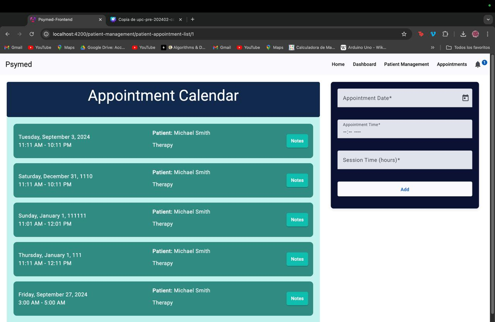

# Capítulo V: Product Implementation, Validation & Deployment
## 5.1 Software Configuration Management
A continuación, presentaremos el proceso por el cual organizamos, gestionamos y controlamos los cambios en el desarrollo de este proyecto.
### 5.1.1. Software Development Environment Configuration.
**Requirements Management**
1. Trello: Es una herramienta utilizada para gestionar el flujo de trabajo de proyectos principalmente basados en marcos de
   trabajos ágiles. Será empleado para visualizar y actualizar el estado actual de las tareas e historias de usuario
   pertenecientes al sprint a desarrollar.  
   Ruta de referencia: https://trello.com/es


**Product UX/UI Design**

1. Figma: Plataforma de elaboración de prototipos y edición gráfica, principalmente utilizado para el diseño digital. En el
   caso del proyecto, será utilizado para el prototipado de la aplicación y sus versiones de Desktop y Mobile Web Browser.

   Ruta de referencia: https://www.figma.com/login
2. Lucidchart: Aplicación para diagramar flujos. Será empleado para el diseño de wireflows, user-flows y el diagrama de
   clases asociado a la aplicación.

   Ruta de referencia: https://www.lucidchart.com/


**Software Development**
1. WebStorm: Entorno de desarrollo integrado elegido por su soporte completo para tecnologías web como JavaScript, HTML, CSS y frameworks como React y Angular. Ofrece refactorización avanzada, depuración, integración con Git y la posibilidad de agregar plugins. Es compatible con varios sistemas operativos, facilitando la colaboración en equipo.

   Ruta de referencia: https://www.jetbrains.com/webstorm/
   <br>
2. HTML5: HyperText Markup Language, o por sus siglas HTML, es un lenguaje de etiquetado para páginas web. Será
   empleado en el desarrollo del proyecto para la presentación del contenido en la aplicación.

   Ruta de referencia: https://www.w3schools.com/html/html5_syntax.asp   
   <br>
3. CSS: Cascading Style Sheets es un lenguaje que maneja el diseño y presentación de las páginas web, el cual va de la mano
   con HTML.

   Ruta de referencia: https://google.github.io/styleguide/htmlcssguide.html
   <br>
   <br>
5. JavaScript: Es un lenguaje de programación interpretado y orientado a objetos. Se utilizará para elaborar la interfaz de
   usuario dentro de la aplicación.

   Ruta de referencia: https://developer.mozilla.org/es/docs/Web/JavaScript
   <br>
   <br>

6. Angular: Es un Framework de JavaScript de código abierto escrito en TypeScript que hemos utilizado para el desarrollo del front-end de nuestro proyecto "PsyMed".
   El código trabajado se puede ver a través de nuestro repositorio.
   Ruta de referencia: https://github.com/WX55-Closed-Source/psymed-frontend

 <br>

**Software Deployment**
1. Git: Una herramienta de control de versiones que facilita el registro y la gestión de las distintas versiones del programa. Su propósito es mantener un historial de cambios y simplificar la corrección de errores. Los integrantes del equipo
   accederán a través de la línea de comandos en sus sistemas locales.

   Ruta de referencia: https://git-scm.com/
   <br>
   <br>
   **Software Documentation and Project Management**
2. Github: Una plataforma en la nube que hospedará los repositorios de código del proyecto. Permitirá la colaboración en
   tiempo real y la revisión de contribuciones de cada miembro del equipo. Los integrantes del equipo podrán acceder a través de sus navegadores web.

   Ruta de referencia: https://github.com/


### 5.1.2. Source Code Management.
El proyecto adoptará las convenciones del modelo GitFlow para la gestión del control de versiones, utilizando GitHub como plataforma principal para alojar y organizar el código. GitFlow es un enfoque estructurado que facilita la colaboración en equipo y la gestión de múltiples versiones de software, asegurando que cada etapa de desarrollo esté debidamente aislada y controlada.

A continuación, se explicará en detalle cómo se implementará este flujo de trabajo, destacando la creación y gestión de ramas para las distintas fases de desarrollo. Además, se proporcionará un enlace al repositorio de GitHub, donde se podrá acceder al reporte del proyecto, la landing page y el avance del frontend de la aplicación, permitiendo un seguimiento claro del progreso y las actualizaciones del código.

**Repositorio de GitHub:**
- Enlace para acceder a la [organización en GitHub](https://github.com/WX55-Closed-Source)
- Enlace para acceder al repositorio de la [landing Page](https://github.com/WX55-Closed-Source/landing-page)
- Enlace para acceder al repositorio del [reporte final](https://github.com/WX55-Closed-Source/report-final-project)
- Enlace para acceder al repositorio del [frontend](https://github.com/WX55-Closed-Source/psymed-frontend)

**Flujo de trabajo GitFlow**

El flujo de trabajo a ser implementado para el desarrollo del proyecto se basará en el modelo propuesto por Vincent Driessen en "A successful Git branching model".


**Estructura de branches (Ramas):**


1. **Master branch (Rama principal):** Esta rama servirá como la principal para la aplicación, albergando versiones estables y finales del desarrollo. Únicamente se aceptarán cambios que hayan sido previamente probados y verificados en las ramas de funcionalidad y, posteriormente, en la rama de desarrollo.

2. **Develop Branch (Rama de Desarrollo):** Esta rama facilita el trabajo colaborativo del equipo y organiza el desarrollo continuo. Aquí se integran las funcionalidades en proceso y se realizan pruebas antes de su fusión con la rama principal, asegurando que el código se mantenga funcional y estable.

3. **Feature branch (Ramas de funcionalidad):** Cada funcionalidad desarrollada por el equipo, o que se aparte del enfoque actual del desarrollo, tendrá su propia rama. Una vez que una funcionalidad esté completamente implementada, se fusionará con la rama de desarrollo del proyecto. Las convenciones para nombrar las ramas de funcionalidad seguirán un patrón descriptivo y único, por ejemplo, "fature/bc-Medication-managment".

### 5.1.3. Source Code Style Guide & Conventions.
**HTML:** Algunas de las prácticas que deben de seguirse para alcanzar un código coherente, sostenible y ordenado son las
siguientes:
1. Cerrar todos los elementos HTML: Por ejemplo, ```<p>Esto es un párrafo.</p>```
2. Siempre declarar el tipo de documento en la primera línea del documento, para
   HTML es "<!DOCTYPE html>”.
3. Escribir en una línea los comentarios cortos.
4. Utilizar comillas en caso de que los atributos contengan espacios entre sí.
5. Procurar especificar el texto alt y las dimensiones width y height de las imágenes, ya que de esta manera se facilitará la
   disponibilidad del contenido. Por ejemplo:   ``````
6. Se nos recomienda no usar el espacio al momento de utilizar los signos porque
   es más fácil de leerlo de esta forma.  
   <br>
   HTML: (https://www.w3schools.com/html/html5_syntax.asp)

**CSS:** Entre las prácticas empleadas se menciona:

1. Se nos recomienda tener una sangría por 2 espacios a la vez, no debemos
   utilizar tabulaciones ni mezclarlas tabulaciones con espacios para la sangría.
2. Todo el código debe estar en minúscula.
3. Eliminar los espacios en blanco.
4. Usar comentarios para explicar el código.
5. Utilizar nombres de clase significativos o genéricos, nombres que reflejen el
   propósito de su elemento.  
   <br>

   CSS: (https://google.github.io/styleguide/htmlcssguide.html)


### 5.1.4. Software Deployment Configuration.
### Landing page deployment:
Para desplegar la landing page es necesario contar con una serie de requisitos, entre ellos, es necesario contar con una cuenta personal, una organización y un repositorio al cual cargar los documentos. A partir de lo anterior, es posible comenzar el despliegue de la landing page. A continuación se enuncian los pasos a seguir:

1. Asegurarse de que los archivos estén en la raíz (root) del repositorio.
2. Asegurarse de que los archivos sigan las nomenclaturas: "index.html" para la landing page, "styles.css" para los estilos, "main.js" para los scripts, y una carpeta llamada "assets/images" para las imágenes.
3. Cargar los archivos al repositorio mediante un commit.
4. Dirigirse a Settings > Pages y seleccionar el branch correspondiente, en este caso el "main".
5. Especificar la carpeta raíz (root) como la fuente de la página.
6. Esperar a que GitHub realice las comprobaciones necesarias. Una vez culminado el proceso, se obtendrá un enlace que llevará a la landing page desplegada.

## GithubPages


Accedemos a la URL proporcionada por GitHub Pages para confirmar que nuestra landing page se haya desplegado correctamente. De este modo, nuestra landing page estará disponible a través de GitHub Pages y será accesible para cualquier usuario que cuente con el enlace.

Accedemos a la URL proporcionada por GitHub Pages para verificar que nuestra landing page se haya desplegado correctamente.
De tal modo, nuestra Landing Page estará inicializada utilizando Github Pages y podrá ser visible para cualquier usuario que tenga el enlace.
Enlace del Landing Page: https://wx55-closed-source.github.io/landing-page/

### 5.2. Landing Page, Services & Applications Implementation.


## 5.2. Landing Page, Services & Applications Implementation
En esta sección se explicará y evidenciará el proceso de implementación, pruebas,
documentación y despliegue del Landing Page.
[Video de Landing Page](https://upcedupe-my.sharepoint.com/:v:/g/personal/u20211c736_upc_edu_pe/EazlWw9ZKSRGpI79_X3OVg8BDuToGt0l99MAgtI0iyw7kw?e=KNWdxW)
### 5.2.1. Sprint 1

### 5.2.1.1. Sprint Planning 1

Para este primer sprint nos enfocaremos en los tasks para la
elaboración de la Landing Page. Nos dividiremos entre nosotros cada
una de las tareas identificadas para el sprint.
<table>
<tr>
    <th colspan="5">Sprint 1</th>
    <th colspan="9">Sprint 1</th>
  </tr>
      <tr>
    <td colspan="13">Sprint Planning Background</td>
  </tr>
  <tr>
    <td colspan="5">Date</td>
    <td colspan="8">2024-09-04</td>
</tr>
  <tr>
    <td colspan="5">Time</td>
    <td colspan="8">5:30 PM</td>
  </tr>
  <tr>
    <td colspan="5">Location</td>
    <td colspan="8">Via Discord</td>
<tr>
    <td colspan="5">Prepared By</td>
    <td colspan="8">Janiel Escalante</td>
</tr>
<tr>
    <td colspan="5">Attendees (to planning meeting)</td>
    <td colspan="8">Janiel Escalante, Romina Maita, Sihuar Ccotarma, Valentino Cervantes, Anatoly Noriega</td>
</tr>
<tr>
    <td colspan="5">Sprint  1 Review Summary</td>
    <td colspan="8">En esta primera sección se planteo el desarrollo de la Landing Page para el proyecto de PsyMed.</td>
</tr>
<tr>
    <td colspan="5">Sprint 1 Retrospective Summary</td>
    <td colspan="8">En esta seccion todos los integrantes mencionaron tener aciertos en partes del codigo y en otras partes poder mejorar sus habilidades realizando la Landing Page</td>
</tr>
<tr>
    <td colspan="13">Sprint Goal & User Stories</td>
</tr>
<tr>
    <td colspan="5">Sprint 1 Goal</td>
    <td colspan="8">
Desarrollar y desplegar una landing page que presente información a los usuarios a través de imágenes y texto, con la capacidad de cambiar de idioma mediante un interruptor de internacionalización. La página debe ser completamente adaptable a cualquier tipo de dispositivo que utilicen los usuarios, garantizando una experiencia de usuario fluida y responsiva.</td>
</tr>
<tr>
    <td colspan="5">Sprint 1 Velocity</td>
    <td colspan="8">4 story points</td>
</tr>
<tr>
    <td colspan="5">Sum of Story Points</td>
    <td colspan="8">4 Story Points</td>
</tr>
</table>

### 5.2.1.2. Sprint Backlog 1

<table>
<tr>
    <th colspan="3">Sprint #</th>
    <th colspan="10">Sprint 1</th>
</tr>
<tr>
    <td colspan="3">User Story</td>
    <td colspan="10">Work-Item/Task</td>
</tr>
<tr>
    <td colspan="1">Id</td>
    <td colspan="2">Title</td>
    <td colspan="1">Id</td>
    <td colspan="2">Title</td>
    <td colspan="3">Description</td>
    <td colspan="1">Estimation</td>
    <td colspan="2">Assigned To</td>
    <td colspan="1">Status (To-do / InProcess / To-Review / Done)</td>
</tr>
<tr>
    <td colspan="1">US01</td>
    <td colspan="2">Encontrar información del propósito de la aplicación</td>
    <td colspan="1">UT01</td>
    <td colspan="2">Crear sección "Acerca de nosotros"</td>
    <td colspan="3">Estructurar y agregar información sobre el propósito de la aplicación.</td>
    <td colspan="1">2</td>
    <td colspan="2">Anatoly</td>
    <td colspan="1">Done</td>
</tr>
<tr>
    <td colspan="1">US02</td>
    <td colspan="2">Encontrar información del propósito de la aplicación</td>
    <td colspan="1">UT02</td>
    <td colspan="2">Crear sección de "Planes" en la landing page</td>
    <td colspan="3">Estructurar la sección de planes.</td>
    <td colspan="1">2</td>
    <td colspan="2">Romina</td>
    <td colspan="1">Done</td>
</tr>
<tr>
    <td colspan="1">US02</td>
    <td colspan="2">Encontrar información del propósito de la aplicación</td>
    <td colspan="1">UT03</td>
    <td colspan="2">Implementar cambio de idioma en la landing page</td>
    <td colspan="3">Implementar la funcionalidad de cambio de idioma en la landing page.</td>
    <td colspan="1">3</td>
    <td colspan="2">Janiel</td>
    <td colspan="1">Done</td>
</tr>
<tr>
    <td colspan="1">US03</td>
    <td colspan="2">Visualización de imágenes y gráficos relevantes</td>
    <td colspan="1">UT04</td>
    <td colspan="2">Añadir imágenes de alta calidad</td>
    <td colspan="3">Incorporar nuevas imágenes de alta calidad que sean relevantes para el contenido.</td>
    <td colspan="1">2</td>
    <td colspan="2">Valentino y Sihuar</td>
    <td colspan="1">Done</td>
</tr>
<tr>
    <td colspan="1">US04</td>
    <td colspan="2">Tipografía cómoda y agradable estéticamente</td>
    <td colspan="1">UT05</td>
    <td colspan="2">Implementar los estilos principales de la tipografía en la landing page</td>
    <td colspan="3">Definir y aplicar los estilos de las fuentes principales para garantizar que sean estéticamente agradables y legibles.</td>
    <td colspan="1">1</td>
    <td colspan="2">Janiel</td>
    <td colspan="1">Done</td>
</tr>
</table>

### 5.2.1.3. Development Evidence for Sprint Review

<table>
    <tr>
        <th colspan="2">Repository</th>
        <th colspan="2">Branch</th>
        <th colspan="2">Commit Id</th>
        <th colspan="2">Commit Message</th>
        <th colspan="2">Commit Message Body</th>
        <th colspan="2">Commited on (Date)</th>
    </tr>
        <tr>
        <td colspan="2">WX55-Closed-Source/landing-page</td>
        <td colspan="2">Main</td>
        <td colspan="2">e82274c</td>
        <td colspan="2">chore: first commit</td>
        <td colspan="2">first commit</td>
        <td colspan="2">03/09/2024</td>
    </tr>
        <tr>
        <td colspan="2">WX55-Closed-Source/landing-page</td>
        <td colspan="2">Main</td>
        <td colspan="2">50b05f3</td>
        <td colspan="2">feat(html): hero created</td>
        <td colspan="2">hero created</td>
        <td colspan="2">03/09/2024</td>
    </tr>
     <tr>
        <td colspan="2">WX55-Closed-Source/landing-page</td>
        <td colspan="2">Main</td>
        <td colspan="2">515afa7</td>
        <td colspan="2">feat(html): structure of about us created</td>
        <td colspan="2">structure of about us created</td>
        <td colspan="2">04/09/2024</td>
    </tr>
    <tr>
        <td colspan="2">WX55-Closed-Source/landing-page</td>
        <td colspan="2">Main</td>
        <td colspan="2">2ec2ab5</td>
        <td colspan="2">refactor(html): members html restructured</td>
        <td colspan="2">members html restructured</td>
        <td colspan="2">04/09/2024</td>
    </tr>
    <tr>
        <td colspan="2">WX55-Closed-Source/landing-page</td>
        <td colspan="2">Main</td>
        <td colspan="2">6efcffd</td>
        <td colspan="2">add div PSYMED</td>
        <td colspan="2">add div PSYMED</td>
        <td colspan="2">04/09/2024</td>
    </tr>
    <tr>
        <td colspan="2">WX55-Closed-Source/landing-page</td>
        <td colspan="2">Main</td>
        <td colspan="2">ec63485</td>
        <td colspan="2">feat: added the 3 suscriptions plans.</td>
        <td colspan="2">added the 3 suscriptions plans.</td>
        <td colspan="2">04/09/2024</td>
    </tr>
    <tr>
        <td colspan="2">WX55-Closed-Source/landing-page</td>
        <td colspan="2">Main</td>
        <td colspan="2">d9bf7cb</td>
        <td colspan="2">feat(about-us): added about us section</td>
        <td colspan="2">added about us section</td>
        <td colspan="2">04/09/2024</td>
    </tr>
    <tr>
        <td colspan="2">WX55-Closed-Source/landing-page</td>
        <td colspan="2">Main</td>
        <td colspan="2">c325e96</td>
        <td colspan="2">feat(about-the-product): added about the product section</td>
        <td colspan="2">added about the product section</td>
        <td colspan="2">04/09/2024</td>
    </tr>
    <tr>
        <td colspan="2">WX55-Closed-Source/landing-page</td>
        <td colspan="2">Main</td>
        <td colspan="2">c152499</td>
        <td colspan="2">refactor: updating Images</td>
        <td colspan="2">updating Images</td>
        <td colspan="2">04/09/2024</td>
    </tr>
</table>

### 5.2.1.4. Testing Suite Evidence for Sprint Review

Para la entrega de este primer Sprint se realizó el desarrollo de la Landing Page. Sin embargo, para esta entrega no se realizaron testeos respecto a la misma.

### 5.2.1.5. Execution Evidence for Sprint Review

Para este primer entregable, hemos elaborado la Landing Page del proyecto de "PsyMed". De tal modo, se podrá visualizar la información relevante sobre nuestra plataforma.

**Sección de Inicio**: Se implementó el Header y la página principal de nuestra Landing Page.


**Sección de Aplicación**: Se implementó la sección de la aplicación detallando el propósito de la misma.


**Sección de Servicios**: Se implementó la sección de los servicios ofrecidos.


**Sección de Planes**: Se implementó la sección de ver los tipos de suscripción.


**Sección de Creadores**: Se añadió la sección de información sobre los desarrolladores de la plataforma.


**Sección de About the Team**: Se implementó la sección del About the Team


**Sección de About the Product**: Se implementó la sección del About the Product


### 5.2.1.6. Services Documentation Evidence for Sprint Review

En el presente sprint solo se desarrollo la Landing Page.

### 5.2.1.7. Software Deployment Evidence for Sprint Review

Para el despliegue de la Landing Page, utilizamos la herramienta GitHub Pages para realizar el deployment. Creamos un repositorio en el cual almacenamos el código de nuestra Landing Page.


Después de crear el repositorio, accedemos a la configuración y seleccionamos la sección de Pages. Allí, ingresamos los datos requeridos, como la fuente del branch que se utilizará para el deployment. Finalmente, GitHub Pages nos proporciona un enlace y publica nuestra Landing Page en la web.


### 5.2.1.8. Team Collaboration Insights during Sprint

Para el desarrollo de este primer sprint, todos los miembros del equipo desarrollaron y colaboraron de manera activa y continua. De tal modo, se muestra como evidencia los insights de cada miembro del equipo.

Commits:


Analiticas de Colaboración:


### 5.3.1. Sprint 2

### 5.3.1.1. Sprint Planning 2
En este sprint, nos enfocaremos en corregir los errores 
detectados en el sprint anterior y nos dedicaremos a la 
implementación del frontend para los bounded contexts 
identificados en el proyecto.

<table>
<tr>
    <th colspan="5">Sprint 2</th>
    <th colspan="9">Sprint 2</th>
  </tr>
      <tr>
    <td colspan="13">Sprint Planning Background</td>
  </tr>
  <tr>
    <td colspan="5">Date</td>
    <td colspan="8"> 17/07/24  </td>
</tr>
  <tr>
    <td colspan="5">Time</td>
    <td colspan="8"> 8:00 PM </td>
  </tr>
  <tr>
    <td colspan="5">Location</td>
    <td colspan="8">Via Discord</td>
<tr>
    <td colspan="5">Prepared By</td>
    <td colspan="8">Janiel Escalante</td>
</tr>
<tr>
    <td colspan="5">Attendees (to planning meeting)</td>
    <td colspan="8">Janiel Escalante, Romina Maita, Sihuar Ccotarma, Valentino Cervantes, Anatoly Noriega</td>
</tr>
<tr>
    <td colspan="5">Sprint 2 Review Summary</td>
    <td colspan="8">
En esta primera sección se presentó el avance del frontend de la aplicación y sus respectivos bounded contexts.
</td>
</tr>
<tr>
    <td colspan="5">Sprint 2 Retrospective Summary</td>
    <td colspan="8">
En esta reunión, todos los integrantes tuvieron aciertos 
en la creación y la implementación del código. Además, 
todos colaboraron en el diseño y la implementación del 
frontend, contribuyendo a un desarrollo más ágil y efectivo
del proyecto.</td>
</tr>
<tr>
    <td colspan="13">Sprint Goal & User Stories</td>
</tr>
<tr>
    <td colspan="5">Sprint 2 Goal</td>
    <td colspan="8">Desarrollar e implementar todas las user stories relacionadas con la lógica de negocio para la aplicación web. Estas incluirán funcionalidades que permitan a los profesionales de la salud mental visualizar datos de seguimiento, registrar pacientes con su información correspondiente, y gestionar elementos como citas y prescripciones. Además, se implementarán funcionalidades que permitan a los pacientes ingresar datos relevantes para su tratamiento.</td>
</tr>
<tr>
    <td colspan="5">Sprint 2 Velocity</td>
    <td colspan="8"> 2 story points</td>
</tr>
<tr>
    <td colspan="5">Sum of Story Points</td>
    <td colspan="8"> 11 Story Points</td>
</tr>
</table>

### 5.3.1.2. Sprint Backlog 2

<table>
<tr>
    <th colspan="3">Sprint 2</th>
    <th colspan="10">Sprint 2</th>
</tr>
<tr>
    <td colspan="3">User Story</td>
    <td colspan="10">Work-Item/Task</td>
</tr>
<tr>
    <td colspan="1">Id</td>
    <td colspan="2">Title</td>
    <td colspan="1">Id</td>
    <td colspan="2">Title</td>
    <td colspan="3">Description</td>
    <td colspan="1">Estimation</td>
    <td colspan="2">Assigned To</td>
    <td colspan="1">Status (To-do / InProcess / To-Review / Done)</td>
</tr>
<tr>
    <td colspan="1">US23</td>
    <td colspan="2">Registro de funciones biológicas</td>
    <td colspan="1">UT01</td>
    <td colspan="2">El paciente puede registrar sus funciones biológicas</td>
    <td colspan="3">El paciente ingresa su estado de ánimo y funciones biológicas</td>
    <td colspan="1">5H</td>
    <td colspan="2">Janiel</td>
    <td colspan="1">Done</td>
</tr>

<tr>
    <td colspan="1">US21</td>
    <td colspan="2">Registro de estado de ánimo</td>
    <td colspan="1">UT</td>
    <td colspan="2">El paciente registra su estado de ánimo</td>
    <td colspan="3">El paciente debe seleccionar el estado de ánimo y se guarda</td>
    <td colspan="1">4H</td>
    <td colspan="2">Janiel - Romina</td>
    <td colspan="1">Done</td>
</tr>
<tr>
    <td colspan="1">US09</td>
    <td colspan="2">Registro de medicamentos del paciente</td>
    <td colspan="1">UT</td>
    <td colspan="2">Service realiza peticiones de la Api del endpoint "medicacions"</td>
    <td colspan="3"> Se realiza el service para realizar las peticiones a la Api</td>
    <td colspan="1">5H</td>
    <td colspan="2">Valentino-Sihuar</td>
    <td colspan="1">Done</td>
</tr>
<tr>
    <td colspan="1">US09</td>
    <td colspan="2">Registro de medicamentos del paciente</td>
    <td colspan="1">UT</td>
    <td colspan="2">El médico registra los medicamentos del paciente en un Forms</td>
    <td colspan="3">El médico registra los datos de los medicamentos de su paciente en un fomrs, que se guardan en la Api</td>
    <td colspan="1">6H</td>
    <td colspan="2">Valentino</td>
    <td colspan="1">Done</td>
</tr>
<tr>
    <td colspan="1">US09</td>
    <td colspan="2">Registro de medicamentos del paciente</td>
    <td colspan="1">UT</td>
    <td colspan="2"> Visualizacion de lista de medicamentos </td>
    <td colspan="3">El medico observa una lista de medicamentos de la Api</td>
    <td colspan="1">4H</td>
    <td colspan="2">Sihuar - Valentino</td>
    <td colspan="1">Done</td>
</tr>
<tr>
    <td colspan="1">US14</td>
    <td colspan="2">Actualizar ingesta de pastillas</td>
    <td colspan="1">UT</td>
    <td colspan="2">El médico puede actualizar la medicación de su paciente</td>
    <td colspan="3">El médico reingresa los datos de su medicacion de su paciente y estos se actualizan en la Api</td>
    <td colspan="1">5H</td>
    <td colspan="2">Valentino - Sihuar</td>
    <td colspan="1">Done</td>
</tr>

<tr>
    <td colspan="1">US12</td>
    <td colspan="2">Visualización de los estados de ánimo del paciente</td>
    <td colspan="1">UT</td>
    <td colspan="2">Se ven los estados de ánimo del paciente</td>
    <td colspan="3">El médico puede observar un gráfico con un reporte de los estados de ánimo</td>
    <td colspan="1">4H</td>
    <td colspan="2">Janiel - Romina</td>
    <td colspan="1">Done</td>
</tr>
<tr>    
    <td colspan="1">US13</td>
    <td colspan="2">Visualizar información del consumo de medicamentos</td>
    <td colspan="1">UT06</td>
    <td colspan="2">Se puede observar la información de los medicamentos</td>
    <td colspan="3">Una pantalla con la información de los medicamentos</td>
    <td colspan="1">5H</td>
    <td colspan="2">Valentino - Anatoly</td>
    <td colspan="1">Done</td>
</tr>
</table>

### 5.3.1.3. Development Evidence for Sprint Review
<table>
    <tr>
        <th colspan="2">Repository</th>
        <th colspan="2">Branch</th>
        <th colspan="2">Commit Id</th>
        <th colspan="2">Commit Message</th>
        <th colspan="2">Commit Message Body</th>
        <th colspan="2">Commited on (Date)</th>
    </tr>
        <tr>
        <td colspan="2">WX55-Closed-Source/psymed-frontend</td>
        <td colspan="2">"dashboard-and-analytics"</td>
        <td colspan="2">9afb750</td>
        <td colspan="2">feat(analytic-dashboard)</td>
        <td colspan="2">service and functions added for biological functions</td>
        <td colspan="2">24/09/2024</td>
    </tr>
        <tr>
        <td colspan="2">WX55-Closed-Source/psymed-frontend</td>
        <td colspan="2">"appointment-and-administration"</td>
        <td colspan="2">3edbd2a</td>
        <td colspan="2">feat(appointment-and-administration)</td>
        <td colspan="2">add form to make new appointments</td>
        <td colspan="2">23/09/2024</td>
    </tr>
     <tr>
        <td colspan="2">WX55-Closed-Source/psymed-frontend</td>
        <td colspan="2">"medication-management"</td>
        <td colspan="2">a300c2c</td>
        <td colspan="2">feat: adding bounded context's components and pages</td>
        <td colspan="2">adding bounded context's components and pages</td>
        <td colspan="2">24/09/2024</td>
    </tr>
    <tr>
        <td colspan="2">WX55-Closed-Source/psymed-frontend</td>
        <td colspan="2">"session-notes"</td>
        <td colspan="2">97ccde2</td>
        <td colspan="2">feat: add note-page component</td>
        <td colspan="2">add note-page component</td>
        <td colspan="2">23/09/2024</td>
    </tr>
    <tr>
        <td colspan="2">WX55-Closed-Source/psymed-frontend</td>
        <td colspan="2">user-management</td>
        <td colspan="2">4b11b9b</td>
        <td colspan="2">feat(patient-item)</td>
        <td colspan="2">added patient item logic</td>
        <td colspan="2">23/09/2024</td>
    </tr>
    
</table>

### 5.3.1.4. Testing Suite Evidence for Sprint Review

Se realizaron pruebas unitarias mediante archivos `.spec.ts` en el proyecto de Angular. A continuación, se muestran imágenes de estas pruebas unitarias.


   //En este test se verifica que el componente App se cree correctamente.//


   //En este test se verifica que el componente Medication se cree correctamente.//


    //En este test se verifica que el componente PacientManagment se cree correctamente.//
### 5.3.1.5. Execution Evidence for Sprint Review

**Gestión de Usuarios**: Permite administrar las cuentas de los usuarios, sus permisos y accesos.

**Gestión de Notas de Sección**: Facilita el registro y seguimiento de notas clínicas importantes por cada sesión o visita.

**Gestión de Administración de Citas**: Optimiza la organización de citas, recordatorios y disponibilidad del personal médico.

**Gestión de Dashboards de Analytics**: Proporciona visualizaciones y análisis de datos relevantes para la toma de decisiones.

**Gestión de Seguimiento de Síntomas y Estado**: Permite monitorear y registrar los síntomas y la evolución del estado de los pacientes.

**Gestión de Medicación**: Administra las prescripciones médicas, recordatorios de dosis y actualizaciones de medicación.

### 5.3.1.6. Services Documentation Evidence for Sprint Review 
link del despliegue del Json:

En esta sección se documentará el servicio base utilizado para otros 
servicios en la aplicación. Se diseñó para facilitar las operaciones 
CRUD a través de una API, utilizando inicialmente un json-server local para 
pruebas y luego migrando a Beeceptor en la aplicación web desplegada. 
Este enfoque permitió validar funcionalidades del front-end sin depender 
de un backend completo, garantizando así una implementación eficiente y 
consistente en toda la aplicación.

| **Elemento**           | **Descripción**                                                                                                                                                       |
|-----------------------|-----------------------------------------------------------------------------------------------------------------------------------------------------------------------|
| **Clase**             | `BaseService<T>`                                                                                                                                                     |
| **Propósito**         | Proveer métodos genéricos para realizar operaciones CRUD (Crear, Leer, Actualizar, Eliminar) en recursos a través de una API.                                      |
| **Dependencias**      | `HttpClient`, `HttpErrorResponse`, `HttpHeaders` de `@angular/common/http`, y `rxjs` para manejo de observables y errores.                                        |
| **Propiedades**       | - `httpOptions`: Opciones de cabecera para las solicitudes HTTP (JSON).                                                                                             |
|                       | - `http`: Instancia de `HttpClient` para realizar solicitudes HTTP.                                                                                                 |
|                       | - `basePath`: Ruta base del servidor, definida en el entorno de desarrollo.                                                                                         |
|                       | - `resourceEndpoint`: Ruta del recurso, por defecto `/resources`.                                                                                                   |
|                       |                                                                                                                                                                       |
| **Métodos**           | - **`create(item: any): Observable<T>`**: Crea un nuevo recurso enviando un objeto `item` a la API.                                                                 |
|                       | - **`update(id: any, item: any): Observable<T>`**: Actualiza un recurso existente identificado por `id`.                                                            |
|                       | - **`delete(id: any): Observable<any>`**: Elimina un recurso identificado por `id`.                                                                                 |
|                       | - **`getAll(): Observable<T[]>`**: Recupera todos los recursos.                                                                                                    |
|                       | - **`getById(id: any): Observable<T>`**: Recupera un recurso específico por `id`.                                                                                   |
|                       | - **`handleError(error: HttpErrorResponse): Observable<never>`**: Maneja errores en las solicitudes HTTP, imprimiendo información del error en la consola.          |
|                       | - **`resourcePath(): string`**: Construye y retorna la ruta completa del recurso.                                                                                   |
| **Manejo de Errores** | Utiliza el operador `catchError` de `rxjs` para capturar y manejar errores en las solicitudes, reintentando la solicitud hasta dos veces antes de fallar.         |
| **Observables**       | Utiliza `Observable` para permitir la suscripción a las respuestas de las solicitudes, facilitando la programación reactiva.                                         |
| **Configuración**     | Se basa en las configuraciones del entorno definidas en `environment.serverBasePath` para la correcta conexión a la API.                                            |


### 5.2.1.7. Software Deployment Evidence for Sprint Review

link to software deployment:https://app.beeceptor.com/console/psymedapi

link para acceder al deployment: [Video de Prueba](https://upcedupe-my.sharepoint.com/:v:/g/personal/u20211c736_upc_edu_pe/EXFlg7PItzRHsng8YK-2cf0Bc2g2GRhyyNFbBzJCEoe9Qg?e=rLm7TU)





### 5.2.1.8. Team Collaboration Insights during Sprint
wW
Para el desarrollo de este sprint, todos los miembros del equipo desarrollaron y colaboraron de manera activa y continua. De tal modo, se muestra como evidencia los insights de cada miembro del equipo.

Commits:


### 5.3.1.2. Sprint Backlog 3

<table border="1">
  <tr>
    <th colspan="3">Sprint 3</th>
    <th colspan="10">Sprint 3</th>
  </tr>
  <tr>
    <td colspan="3">User Story</td>
    <td colspan="10">Work-Item/Task</td>
  </tr>
  <tr>
    <td colspan="1">ID</td>
    <td colspan="2">Title</td>
    <td colspan="1">ID</td>
    <td colspan="2">Title</td>
    <td colspan="3">Description</td>
    <td colspan="1">Estimation</td>
    <td colspan="2">Assigned to</td>
    <td colspan="1">Status (To-do / InProcess / To-Review / Done)</td>
  </tr>
  <tr>
    <td colspan="1">TS24</td>
    <td colspan="2">Registro de sesión terapéutica a través de un RESTful API</td>
    <td colspan="1">UT01</td>
    <td colspan="2">Desarrollo de capa de aplicación</td>
    <td colspan="3">Crear el servicio de "Registrar Sesión Terapéutica" que procese la información y valide los datos requeridos.</td>
    <td colspan="1">3h</td>
    <td colspan="2">Anatoly</td>
    <td colspan="1">Done</td>
  </tr>
  <tr>
    <td colspan="1"></td>
    <td colspan="2"></td>
    <td colspan="1">UT02</td>
    <td colspan="2">Desarrollo de capa de dominio</td>
    <td colspan="3">Implementar modelos y servicios para registrar una sesión terapéutica, asegurando la integración con entidades de paciente y profesional.</td>
    <td colspan="1">3h</td>
    <td colspan="2">Anatoly</td>
    <td colspan="1">Done</td>
  </tr>
  <tr>
    <td colspan="1"></td>
    <td colspan="2"></td>
    <td colspan="1">UT03</td>
    <td colspan="2">Desarrollo de capa de infraestructura</td>
    <td colspan="3">Crear el endpoint POST para registrar la sesión en el sistema, manejando los errores en caso de datos faltantes o duplicados.</td>
    <td colspan="1">4h</td>
    <td colspan="2">Anatoly</td>
    <td colspan="1">Done</td>
  </tr>
  <tr>
    <td colspan="1"></td>
    <td colspan="2"></td>
    <td colspan="1">UT04</td>
    <td colspan="2">Desarrollo de capa de interfaces</td>
    <td colspan="3">Crear controladores que reciban y gestionen las solicitudes de creación de sesión terapéutica.</td>
    <td colspan="1">4h</td>
    <td colspan="2">Anatoly</td>
    <td colspan="1">Done</td>
  </tr>
  <tr>
    <td colspan="1">TS25</td>
    <td colspan="2">Obtener sesión terapéutica a través de un RESTful API</td>
    <td colspan="1">UT05</td>
    <td colspan="2">Desarrollo de capa de aplicación</td>
    <td colspan="3">Crear el servicio de "Obtener Sesión Terapéutica" que procese la solicitud y recupere los detalles de la sesión según el ID proporcionado.</td>
    <td colspan="1">3h</td>
    <td colspan="2">Anatoly</td>
    <td colspan="1">Done</td>
  </tr>
  <tr>
    <td colspan="1"></td>
    <td colspan="2"></td>
    <td colspan="1">UT06</td>
    <td colspan="2">Desarrollo de capa de dominio</td>
    <td colspan="3">Implementar modelos y servicios para recuperar la información de una sesión terapéutica, validando la existencia de la sesión y su relación con el paciente.</td>
    <td colspan="1">3h</td>
    <td colspan="2">Anatoly</td>
    <td colspan="1">Done</td>
  </tr>
  <tr>
    <td colspan="1"></td>
    <td colspan="2"></td>
    <td colspan="1">UT07</td>
    <td colspan="2">Desarrollo de capa de infraestructura</td>
    <td colspan="3">Crear el endpoint GET que permita obtener los detalles de la sesión terapéutica según el ID de la sesión, incluyendo control de errores para sesiones no encontradas.</td>
    <td colspan="1">4h</td>
    <td colspan="2">Anatoly</td>
    <td colspan="1">Done</td>
  </tr>
  <tr>
    <td colspan="1"></td>
    <td colspan="2"></td>
    <td colspan="1">UT08</td>
    <td colspan="2">Desarrollo de capa de interfaces</td>
    <td colspan="3">Crear controladores que gestionen las solicitudes de obtención de sesiones, manejando las respuestas y el retorno de errores cuando la sesión no existe.</td>
    <td colspan="1">4h</td>
    <td colspan="2">Anatoly</td>
    <td colspan="1">Done</td>
  </tr>
  <tr>
    <td colspan="1">US12</td>
    <td colspan="2"></td>
    <td colspan="1">UT09</td>
    <td colspan="2">lista de estados emocionales del paciente</td>
    <td colspan="3">Crear una page donde el profesional pueda ver los estados de ánimo históricos del paciente seleccionado</td>
    <td colspan="1">2h</td>
    <td colspan="2">Valentino</td>
    <td colspan="1">Done</td>
  </tr>
  <tr>
    <td colspan="1"></td>
    <td colspan="2"></td>
    <td colspan="1">UT10</td>
    <td colspan="2">componente de estado de ánimo</td>
    <td colspan="3">Crear una card que almacene un registro de estado de animo</td>
    <td colspan="1">1h</td>
    <td colspan="2">Valentino</td>
    <td colspan="1">Done</td>
  </tr>
  <tr>
    <td colspan="1">US13</td>
    <td colspan="2"></td>
    <td colspan="1">UT11</td>
    <td colspan="2">Desarrollo de card de los elementos de un medicamento</td>
    <td colspan="3">Crear una card que almacene los elementos de medicacion y que pueda tener los botones de edicion exclusivas para el profesional.</td>
    <td colspan="1">1h</td>
    <td colspan="2">Valentino</td>
    <td colspan="1">Done</td>
  </tr>
  <tr>
    <td colspan="1"></td>
    <td colspan="2"></td>
    <td colspan="1">UT12</td>
    <td colspan="2">Registrar confirmación de cumplimiento de medicación</td>
    <td colspan="3">Implementar un toogle que pueda cambiar el estatus de una medicacion a eleccion del paciente</td>
    <td colspan="1">1h</td>
    <td colspan="2">Valentino</td>
    <td colspan="1">Done</td>
  </tr>
  <tr>
    <td colspan="1">US14</td>
    <td colspan="2"></td>
    <td colspan="1">UT13</td>
    <td colspan="2">Edicion de medicación</td>
    <td colspan="3">Crear un botón que permita editar los datos una medicación</td>
    <td colspan="1">1h</td>
    <td colspan="2">Valentino</td>
    <td colspan="1">Done</td>
  </tr>
  <tr>
    <td colspan="1"></td>
    <td colspan="2"></td>
    <td colspan="1">UT14</td>
    <td colspan="2">Implementar validaciones reactivas</td>
    <td colspan="3">Implementar validaciones reactivas que impidan el ingreso de datos invalido como campo para las medicaciones</td>
    <td colspan="1">1h</td>
    <td colspan="2">Valentino</td>
    <td colspan="1">Done</td>
  </tr>
  <tr>
    <td colspan="1">US15</td>
    <td colspan="2"></td>
    <td colspan="1">UT15</td>
    <td colspan="2">Card de notas de sesion</td>
    <td colspan="3">Crear una card que contenga los elementos de la entidad “Session Notes”</td>
    <td colspan="1">1h</td>
    <td colspan="2">Valentino</td>
    <td colspan="1">Done</td>
  </tr>
  <tr>
    <td colspan="1"></td>
    <td colspan="2"></td>
    <td colspan="1">UT16</td>
    <td colspan="2">Formulario de creacion de notas por sesion</td>
    <td colspan="3">Desarrollar un formulario de creacion de notas por sesion</td>
    <td colspan="1">1h</td>
    <td colspan="2">Valentino</td>
    <td colspan="1">Done</td>
  </tr>
  <tr>
    <td colspan="1"></td>
    <td colspan="2"></td>
    <td colspan="1">UT17</td>
    <td colspan="2">Validaciones reactivas para datos inválidos</td>
    <td colspan="3">Implementar una validación de datos inválidos de forma reactiva al crear notas por sesión</td>
    <td colspan="1">1h</td>
    <td colspan="2">Valentino</td>
    <td colspan="1">Done</td>
  </tr>
  <tr>
    <td colspan="1">US16</td>
    <td colspan="2"></td>
    <td colspan="1">UT18</td>
    <td colspan="2">Formulario de edicion de notas</td>
    <td colspan="3">Crear un formulario de edicion de notas</td>
    <td colspan="1">2h</td>
    <td colspan="2">Valentino</td>
    <td colspan="1">Done</td>
  </tr>
  <tr>
    <td colspan="1"></td>
    <td colspan="2"></td>
    <td colspan="1">UT19</td>
    <td colspan="2">validaciones reactivas para datos invalidos</td>
    <td colspan="3">Implementar una validación de datos inválidos de forma reactiva al editar notas.</td>
    <td colspan="1">1h</td>
    <td colspan="2">Valentino</td>
    <td colspan="1">Done</td>
  </tr>
  <tr>
    <td colspan="1">US17</td>
    <td colspan="2"></td>
    <td colspan="1">UT20</td>
    <td colspan="2">Formulario de edición del diagnostico de paciente</td>
    <td colspan="3">Crear un formulario de edicion para los diagnósticos del paciente</td>
    <td colspan="1"></td>
    <td colspan="2">Valentino</td>
    <td colspan="1">Done</td>
  </tr>
  <tr>
    <td colspan="1"></td>
    <td colspan="2"></td>
    <td colspan="1">UT21</td>
    <td colspan="2">validaciones reactivas para medición del diagnostico</td>
    <td colspan="3">Implementar una validación de datos inválidos de forma reactiva al editar diagnosticos.</td>
    <td colspan="1">1h</td>
    <td colspan="2">Valentino</td>
    <td colspan="1"></td>
  </tr>
  <tr>
    <td colspan="1">TS11</td>
    <td colspan="2">Actualizar información de consumo de pastillas del paciente a través de un RESTful API</td>
    <td colspan="1">UT22</td>
    <td colspan="2">Desarrollo de capa de aplicación</td>
    <td colspan="3">Crear el servicio de "Actualizar Consumo de Pastillas".</td>
    <td colspan="1">3h</td>
    <td colspan="2">Romina</td>
    <td colspan="1">Done</td>
  </tr>
  <tr>
    <td colspan="1"></td>
    <td colspan="2"></td>
    <td colspan="1">UT23</td>
    <td colspan="2">Desarrollo de capa de dominio</td>
    <td colspan="3">Implementar modelos y servicios para actualizar información de consumo de pastillas.</td>
    <td colspan="1">3h</td>
    <td colspan="2">Romina</td>
    <td colspan="1">Done</td>
  </tr>
  <tr>
    <td colspan="1"></td>
    <td colspan="2"></td>
    <td colspan="1">UT24</td>
    <td colspan="2">Desarrollo de capa de infraestructura</td>
    <td colspan="3">Crear el endpoint PUT</td>
    <td colspan="1">4h</td>
    <td colspan="2">Romina</td>
    <td colspan="1">Done</td>
  </tr>
  <tr>
    <td colspan="1"></td>
    <td colspan="2"></td>
    <td colspan="1">UT25</td>
    <td colspan="2">Desarrollo de capa de interfaces</td>
    <td colspan="3">Crear controladores</td>
    <td colspan="1">4h</td>
    <td colspan="2">Romina</td>
    <td colspan="1">Done</td>
  </tr>
  <tr>
    <td colspan="1">TS07</td>
    <td colspan="2">Añadir medicamentos de un paciente a través de un RESTful API</td>
    <td colspan="1">UT26</td>
    <td colspan="2">Desarrollo de capa de aplicación</td>
    <td colspan="3">Crear el servicio de "Añadir Medicamento a Paciente".</td>
    <td colspan="1">3h</td>
    <td colspan="2">Romina</td>
    <td colspan="1">Done</td>
  </tr>
  <tr>
    <td colspan="1"></td>
    <td colspan="2"></td>
    <td colspan="1">UT27</td>
    <td colspan="2">Desarrollo de capa de dominio</td>
    <td colspan="3">Implementar modelos y servicios para añadir medicamentos.</td>
    <td colspan="1">3h</td>
    <td colspan="2">Romina</td>
    <td colspan="1">Done</td>
  </tr>
  <tr>
    <td colspan="1"></td>
    <td colspan="2"></td>
    <td colspan="1">UT28</td>
    <td colspan="2">Desarrollo de capa de infraestructura</td>
    <td colspan="3">Crear el endpoint POST</td>
    <td colspan="1">4h</td>
    <td colspan="2">Romina</td>
    <td colspan="1">Done</td>
  </tr>
  <tr>
    <td colspan="1"></td>
    <td colspan="2"></td>
    <td colspan="1">UT29</td>
    <td colspan="2">Desarrollo de capa de interfaces</td>
    <td colspan="3">Crear controladores</td>
    <td colspan="1">4h</td>
    <td colspan="2">Romina</td>
    <td colspan="1">Done</td>
  </tr>
  <tr>
    <td colspan="1">TS10</td>
    <td colspan="2">Recuperar datos de consumo de medicamentos válidos</td>
    <td colspan="1">UT30</td>
    <td colspan="2">Desarrollo de capa de aplicación</td>
    <td colspan="3">Crear el servicio de "Recuperar Datos de Consumo Válido".</td>
    <td colspan="1">3h</td>
    <td colspan="2">Romina</td>
    <td colspan="1">Done</td>
  </tr>
  <tr>
    <td colspan="1"></td>
    <td colspan="2"></td>
    <td colspan="1">UT31</td>
    <td colspan="2">Desarrollo de capa de dominio</td>
    <td colspan="3">Implementar modelos y servicios para recuperar datos de consumo de medicamentos válidos</td>
    <td colspan="1">3h</td>
    <td colspan="2">Romina</td>
    <td colspan="1">Done</td>
  </tr>
  <tr>
    <td colspan="1"></td>
    <td colspan="2"></td>
    <td colspan="1">UT32</td>
    <td colspan="2">Desarrollo de capa de infraestructura</td>
    <td colspan="3">Crear el endpoint GET</td>
    <td colspan="1">4h</td>
    <td colspan="2">Romina</td>
    <td colspan="1">Done</td>
  </tr>
  <tr>
    <td colspan="1"></td>
    <td colspan="2"></td>
    <td colspan="1">UT33</td>
    <td colspan="2">Desarrollo de capa de interfaces</td>
    <td colspan="3">Crear controladores</td>
    <td colspan="1">4h</td>
    <td colspan="2">Romina</td>
    <td colspan="1">Done</td>
  </tr>
<tr>
    <td colspan="1">TS20</td>
    <td colspan="2">Registro de confirmación de consumo de pastillas a través de un RESTful API</td>
    <td colspan="1">UT20</td>
    <td colspan="2">Desarrollo de capa de aplicación</td>
    <td colspan="3">Crear el servicio de "Confirmación de Consumo de Pastillas".</td>
    <td colspan="1">3h</td>
    <td colspan="2">Romina</td>
    <td colspan="1">Done</td>
</tr>
<tr>
    <td colspan="1"></td>
    <td colspan="2"></td>
    <td colspan="1">UT21</td>
    <td colspan="2">Desarrollo de capa de dominio</td>
    <td colspan="3">Implementar modelos y servicios para recuperar datos de consumo de medicamentos válidos</td>
    <td colspan="1">3h</td>
    <td colspan="2">Romina</td>
    <td colspan="1">Done</td>
</tr>
<tr>
    <td colspan="1"></td>
    <td colspan="2"></td>
    <td colspan="1">UT22</td>
    <td colspan="2">Desarrollo de capa de infraestructura</td>
    <td colspan="3">Crear el endpoint POST</td>
    <td colspan="1">4h</td>
    <td colspan="2">Romina</td>
    <td colspan="1">Done</td>
</tr>
<tr>
    <td colspan="1"></td>
    <td colspan="2"></td>
    <td colspan="1">UT23</td>
    <td colspan="2">Desarrollo de capa de interfaces</td>
    <td colspan="3">Crear controladores</td>
    <td colspan="1">4h</td>
    <td colspan="2">Romina</td>
    <td colspan="1">Done</td>
</tr>
<tr>
    <td colspan="1">TS05</td>
    <td colspan="2">Inicio de sesión a través de un RESTful API</td>
    <td colspan="1">UT24</td>
    <td colspan="2">Comandos y servicios para sign in</td>
    <td colspan="3">Desarrollo de comandos y servicios para sign in</td>
    <td colspan="1">1h</td>
    <td colspan="2">Franz</td>
    <td colspan="1">Done</td>
</tr>
<tr>
    <td colspan="1"></td>
    <td colspan="2"></td>
    <td colspan="1">UT25</td>
    <td colspan="2">Controlador para el inicio de sesión</td>
    <td colspan="3">Desarrollo del controlador para acceder al endpoint de inicio de sesión</td>
    <td colspan="1">1h</td>
    <td colspan="2">Franz</td>
    <td colspan="1">Done</td>
</tr>
<tr>
    <td colspan="1">TS01</td>
    <td colspan="2">Añadir paciente a través de un RESTful API</td>
    <td colspan="1">UT26</td>
    <td colspan="2">Capa de dominio e infraestructura del paciente</td>
    <td colspan="3">Desarrollo de la capa de dominio e infraestructura para el perfil del paciente</td>
    <td colspan="1">2h</td>
    <td colspan="2">Franz</td>
    <td colspan="1">Done</td>
</tr>
<tr>
    <td colspan="1"></td>
    <td colspan="2"></td>
    <td colspan="1">UT27</td>
    <td colspan="2">Capa de aplicación e interfaz</td>
    <td colspan="3">Desarrollo de la capa de aplicación e interfaz para el perfil del paciente</td>
    <td colspan="1">2h</td>
    <td colspan="2">Franz</td>
    <td colspan="1">Done</td>
</tr>
<tr>
    <td colspan="1"></td>
    <td colspan="2"></td>
    <td colspan="1">UT28</td>
    <td colspan="2">Creación de ACL en capa de interfaz</td>
    <td colspan="3">Desarrollo de ACL para comunicación entre BC</td>
    <td colspan="1">1h</td>
    <td colspan="2">Franz</td>
    <td colspan="1">Done</td>
</tr>
<tr>
    <td colspan="1"></td>
    <td colspan="2"></td>
    <td colspan="1">UT29</td>
    <td colspan="2">Uso de ACL en capa aplicación</td>
    <td colspan="3">Desarrollo de servicio que usa ACL para comunicación entre BC</td>
    <td colspan="1">1h</td>
    <td colspan="2">Franz</td>
    <td colspan="1">Done</td>
</tr>
<tr>
    <td colspan="1">TS02</td>
    <td colspan="2">Añadir profesional de la salud mental a través de un RESTful API</td>
    <td colspan="1">UT30</td>
    <td colspan="2">Capa de dominio e infraestructura del profesional</td>
    <td colspan="3">Desarrollo de la capa de dominio e infraestructura para el perfil del profesional</td>
    <td colspan="1">2h</td>
    <td colspan="2">Franz</td>
    <td colspan="1">Done</td>
</tr>
<tr>
    <td colspan="1"></td>
    <td colspan="2"></td>
    <td colspan="1">UT31</td>
    <td colspan="2">Capa de aplicación e interfaz</td>
    <td colspan="3">Desarrollo de la capa de aplicación e interfaz para el perfil del profesional</td>
    <td colspan="1">2h</td>
    <td colspan="2">Franz</td>
    <td colspan="1">Done</td>
</tr>
<tr>
    <td colspan="1"></td>
    <td colspan="2"></td>
    <td colspan="1">UT32</td>
    <td colspan="2">Creación de ACL en capa de interfaz</td>
    <td colspan="3">Desarrollo de ACL para comunicación entre BC</td>
    <td colspan="1">1h</td>
    <td colspan="2">Franz</td>
    <td colspan="1">Done</td>
</tr>
<tr>
    <td colspan="1"></td>
    <td colspan="2"></td>
    <td colspan="1">UT33</td>
    <td colspan="2">Uso de ACL en capa aplicación</td>
    <td colspan="3">Desarrollo de servicio que usa ACL para comunicación entre BC</td>
    <td colspan="1">1h</td>
    <td colspan="2">Franz</td>
    <td colspan="1">Done</td>
</tr>
<tr>
    <td colspan="1">TS21</td>
    <td colspan="2">Registro de funciones biológicas a través de un RESTful API</td>
    <td colspan="1">UT34</td>
    <td colspan="2">Capa de dominio e infraestructura del registro de funciones biológicas</td>
    <td colspan="3">Desarrollo de la capa de dominio e infraestructura para el registro de funciones biológicas</td>
    <td colspan="1">2h</td>
    <td colspan="2">Franz</td>
    <td colspan="1">Done</td>
</tr>
<tr>
    <td colspan="1"></td>
    <td colspan="2"></td>
    <td colspan="1">UT35</td>
    <td colspan="2">Capa de aplicación e interfaz</td>
    <td colspan="3">Desarrollo de la capa de aplicación e interfaz para el perfil del profesional</td>
    <td colspan="1">2h</td>
    <td colspan="2">Franz</td>
    <td colspan="1">Done</td>
</tr>
<tr>
    <td colspan="1"></td>
    <td colspan="2"></td>
    <td colspan="1">UT36</td>
    <td colspan="2">Creación de ACL en capa de interfaz</td>
    <td colspan="3">Desarrollo de ACL para comunicación entre BC</td>
    <td colspan="1">1h</td>
    <td colspan="2">Franz</td>
    <td colspan="1">Done</td>
</tr>
<tr>
    <td colspan="1"></td>
    <td colspan="2"></td>
    <td colspan="1">UT37</td>
    <td colspan="2">Uso de ACL en capa aplicación</td>
    <td colspan="3">Desarrollo de servicio que usa ACL para comunicación entre BC</td>
    <td colspan="1">1h</td>
    <td colspan="2">Franz</td>
    <td colspan="1">Done</td>
</tr>
<tr>
    <td colspan="1">TS19</td>
    <td colspan="2">Registro de estado de ánimo del paciente a través de un RESTful API</td>
    <td colspan="1">UT38</td>
    <td colspan="2">Capa de dominio e infraestructura del registro de estado de ánimo</td>
    <td colspan="3">Agregar el registro de estado de ánimo a la capa de dominio e infraestructura para el registro de funciones biológicas</td>
    <td colspan="1">2h</td>
    <td colspan="2">Franz</td>
    <td colspan="1">Done</td>
</tr>
<tr>
    <td colspan="1"></td>
    <td colspan="2"></td>
    <td colspan="1">UT39</td>
    <td colspan="2">Capa de aplicación e interfaz</td>
    <td colspan="3">Agregar el registro de estados de ánimo del paciente a la capa de aplicación e interfaz para el perfil del profesional</td>
    <td colspan="1">2h</td>
    <td colspan="2">Franz</td>
    <td colspan="1">Done</td>
</tr>
<tr>
    <td colspan="1">TS16</td>
    <td colspan="2">Obtener recordatorio de actividades a través de un RESTful API</td>
    <td colspan="1">UT40</td>
    <td colspan="2">Creación de tareas</td>
    <td colspan="3">Creación de tareas.</td>
    <td colspan="1">3h</td>
    <td colspan="2">David</td>
    <td colspan="1">Done</td>
</tr>
  </table>

### 5.3.1.3. Development Evidence for Sprint Review
<table>
    <tr>
        <th colspan="2">Repository</th>
        <th colspan="2">Branch</th>
        <th colspan="2">Commit Id</th>
        <th colspan="2">Commit Message</th>
        <th colspan="2">Commit Message Body</th>
        <th colspan="2">Commited on (Date)</th>
    </tr>
        <tr>
        <td colspan="2">WX55-Closed-Source/psymed-frontend</td>
        <td colspan="2">"i18n"</td>
        <td colspan="2">a2e89a3</td>
        <td colspan="2">feat(i18n)</td>
        <td colspan="2">add i18n to diagnostic edit component</td>
        <td colspan="2">29/10/2024</td>
    </tr>
        <tr>
        <td colspan="2">WX55-Closed-Source/psymed-frontend</td>
        <td colspan="2">"appointment-and-administration"</td>
        <td colspan="2">c7b3006</td>
        <td colspan="2">refactor</td>
        <td colspan="2">added logic to edit the profile of patients being a professional</td>
        <td colspan="2">15/10/2024</td>
    </tr>
     <tr>
        <td colspan="2">WX55-Closed-Source/psymed-frontend</td>
        <td colspan="2">"iam"</td>
        <td colspan="2">a300c2c</td>
        <td colspan="2">feat: adding bounded context's components and pages</td>
        <td colspan="2">adding bounded context's components and pages</td>
        <td colspan="2">24/09/2024</td>
    </tr>
    <tr>
        <td colspan="2">WX55-Closed-Source/psymed-frontend</td>
        <td colspan="2">"diagnostic"</td>
        <td colspan="2">f1588f7</td>
        <td colspan="2">feat</td>
        <td colspan="2">adding patient's appointment page with task confirmation.</td>
        <td colspan="2">30/10/2024</td>
    </tr>
    <tr>
        <td colspan="2">WX55-Closed-Source/psymed-frontend</td>
        <td colspan="2">appointment-and-administration</td>
        <td colspan="2">5b711bf</td>
        <td colspan="2">fix(appointment-and-administration):</td>
        <td colspan="2">add appointment form correction</td>
        <td colspan="2">16/10/2024</td>
    </tr>

</table>
<table>
    <tr>
        <th colspan="2">Repository</th>
        <th colspan="2">Branch</th>
        <th colspan="2">Commit Id</th>
        <th colspan="2">Commit Message</th>
        <th colspan="2">Commit Message Body</th>
        <th colspan="2">Commited on (Date)</th>
    </tr>
        <tr>
        <td colspan="2">WX55-Closed-Source/psymed-platform</td>
        <td colspan="2">"appointment-and-administration"</td>
        <td colspan="2">56ebf5a9a84020e064b74b0ca2df3231dc30e0da</td>
        <td colspan="2">feat(appointment-and-administration):</td>
        <td colspan="2">added the validation of the outbound service for external profile service</td>
        <td colspan="2">28/10/2024</td>
    </tr>
        <tr>
        <td colspan="2">WX55-Closed-Source/psymed-platform</td>
        <td colspan="2">"patient-report"</td>
        <td colspan="2">8b59b9cb430edd3a62e54d777d2e6d3534856eb6</td>
        <td colspan="2">refactor(profiles):</td>
        <td colspan="2">professional command service using external service</td>
        <td colspan="2">27/10/2024</td>
    </tr>
     <tr>
        <td colspan="2">WX55-Closed-Source/psymed-platform</td>
        <td colspan="2">"session-notes-and-tasks"</td>
        <td colspan="2">a4e86c541b9e2a8398968231a5b0a7e1194c3205</td>
        <td colspan="2">feat(note):</td>
        <td colspan="2">create note entities and services</td>
        <td colspan="2">30/10/2024</td>
    </tr>
    <tr>
        <td colspan="2">WX55-Closed-Source/psymed-platform</td>
        <td colspan="2">"treatment-management"</td>
        <td colspan="2">2dca9e872656b745bbebda11ebfdcce65e8972b7</td>
        <td colspan="2">feat(medication):</td>
        <td colspan="2">add medication controller.</td>
        <td colspan="2">30/10/2024</td>
    </tr>
    <tr>
        <td colspan="2">WX55-Closed-Source/psymed-platform</td>
        <td colspan="2">appointment-and-administration</td>
        <td colspan="2">d32c169dbb8f4ac9c2f8ef5521b7c9ccfe5f47ea</td>
        <td colspan="2">feat:</td>
        <td colspan="2">adding get medication by id query</td>
        <td colspan="2">28/10/2024</td>
    </tr>

</table>
### 5.3.1.4. Testing Suite Evidence for Sprint Review

Se realizaron pruebas unitarias mediante archivos `.spec.ts` en el proyecto de Angular. A continuación, se muestran imágenes de estas pruebas unitarias.


//En este test se verifica que el componente App se cree correctamente.//


//En este test se verifica que el componente Medication se cree correctamente.//


//En este test se verifica que el componente PacientManagment se cree correctamente.//
### 5.3.1.5. Execution Evidence for Sprint Review

**Gestión de Usuarios**: Permite administrar las cuentas de los usuarios, sus permisos y accesos.

**Gestión de Notas de Sección**: Facilita el registro y seguimiento de notas clínicas importantes por cada sesión o visita.

**Gestión de Administración de Citas**: Optimiza la organización de citas, recordatorios y disponibilidad del personal médico.

**Gestión de Dashboards de Analytics**: Proporciona visualizaciones y análisis de datos relevantes para la toma de decisiones.

**Gestión de Seguimiento de Síntomas y Estado**: Permite monitorear y registrar los síntomas y la evolución del estado de los pacientes.

**Gestión de Medicación**: Administra las prescripciones médicas, recordatorios de dosis y actualizaciones de medicación.

### 5.3.1.6. Services Documentation Evidence for Sprint Review
link del despliegue del Json:

En esta sección se documentará el servicio base utilizado para otros
servicios en la aplicación. Se diseñó para facilitar las operaciones
CRUD a través de una API, utilizando inicialmente un json-server local para
pruebas y luego migrando a Beeceptor en la aplicación web desplegada.
Este enfoque permitió validar funcionalidades del front-end sin depender
de un backend completo, garantizando así una implementación eficiente y
consistente en toda la aplicación.

| **Elemento**           | **Descripción**                                                                                                                                                       |
|-----------------------|-----------------------------------------------------------------------------------------------------------------------------------------------------------------------|
| **Clase**             | `BaseService<T>`                                                                                                                                                     |
| **Propósito**         | Proveer métodos genéricos para realizar operaciones CRUD (Crear, Leer, Actualizar, Eliminar) en recursos a través de una API.                                      |
| **Dependencias**      | `HttpClient`, `HttpErrorResponse`, `HttpHeaders` de `@angular/common/http`, y `rxjs` para manejo de observables y errores.                                        |
| **Propiedades**       | - `httpOptions`: Opciones de cabecera para las solicitudes HTTP (JSON).                                                                                             |
|                       | - `http`: Instancia de `HttpClient` para realizar solicitudes HTTP.                                                                                                 |
|                       | - `basePath`: Ruta base del servidor, definida en el entorno de desarrollo.                                                                                         |
|                       | - `resourceEndpoint`: Ruta del recurso, por defecto `/resources`.                                                                                                   |
|                       |                                                                                                                                                                       |
| **Métodos**           | - **`create(item: any): Observable<T>`**: Crea un nuevo recurso enviando un objeto `item` a la API.                                                                 |
|                       | - **`update(id: any, item: any): Observable<T>`**: Actualiza un recurso existente identificado por `id`.                                                            |
|                       | - **`delete(id: any): Observable<any>`**: Elimina un recurso identificado por `id`.                                                                                 |
|                       | - **`getAll(): Observable<T[]>`**: Recupera todos los recursos.                                                                                                    |
|                       | - **`getById(id: any): Observable<T>`**: Recupera un recurso específico por `id`.                                                                                   |
|                       | - **`handleError(error: HttpErrorResponse): Observable<never>`**: Maneja errores en las solicitudes HTTP, imprimiendo información del error en la consola.          |
|                       | - **`resourcePath(): string`**: Construye y retorna la ruta completa del recurso.                                                                                   |
| **Manejo de Errores** | Utiliza el operador `catchError` de `rxjs` para capturar y manejar errores en las solicitudes, reintentando la solicitud hasta dos veces antes de fallar.         |
| **Observables**       | Utiliza `Observable` para permitir la suscripción a las respuestas de las solicitudes, facilitando la programación reactiva.                                         |
| **Configuración**     | Se basa en las configuraciones del entorno definidas en `environment.serverBasePath` para la correcta conexión a la API.                                            |


### 5.2.1.7. Software Deployment Evidence for Sprint Review

link to software deployment:https://alurageek-api-peach.vercel.app/    
link to Frontend deployment:https://remarkable-kulfi-56550c.netlify.app/home

link para acceder al deployment: [Video de Prueba](https://upcedupe-my.sharepoint.com/:v:/g/personal/u20211c736_upc_edu_pe/EXFlg7PItzRHsng8YK-2cf0Bc2g2GRhyyNFbBzJCEoe9Qg?e=rLm7TU)


### 5.2.1.8. Team Collaboration Insights during Sprint
wW
Para el desarrollo de este sprint, todos los miembros del equipo desarrollaron y colaboraron de manera activa y continua. De tal modo, se muestra como evidencia los insights de cada miembro del equipo.

Commits:


# Conclusiones 

1. **Creciente Demanda de Soluciones**: Existe un interés creciente en tecnologías para la salud mental, lo que presenta una gran oportunidad para PsyMed.

2. **Deficiencias en Competidores**: Muchas aplicaciones actuales son insuficientes en el manejo de datos de pacientes. PsyMed debe superar estas limitaciones con un sistema más eficiente.

3. **Uso Eficiente de GitHub**: GitHub ha mejorado la colaboración y control de versiones, lo que asegura un desarrollo de calidad y organizado.

4. **Importancia de la Investigación**: Las entrevistas y estudios han permitido comprender mejor las necesidades de psiquiatras y pacientes, guiando el diseño de la solución.

5. **Consistencia Visual**: Las guías de estilo son clave para mantener una identidad coherente y mejorar la experiencia del usuario.

6. **Priorización Clara**: La correcta priorización de User Stories y Product Backlog asegura que el equipo se enfoque en las características más importantes.

7. **Desarrollo Ágil con Sprints**: Limitar los user story points por sprint ha permitido un avance ordenado sin sobrecargar al equipo.

8. **Retroalimentación Continua**: Las reuniones de feedback han sido esenciales para hacer ajustes y mejoras a lo largo del desarrollo.

9. **Manejo de Pendientes**: Estimar tiempos adicionales es importante para lidiar con tareas no planificadas y mantener los plazos.

# Anexos

Video TB1: https://www.youtube.com/watch?v=FlChiyIqaeE

Video entrevistas: https://upcedupe-my.sharepoint.com/:v:/g/personal/u202213765_upc_edu_pe/ESKZeR1QZ9tMqVNWhCCyqFABPQqgTTVaG5g92D72SDbIrg?e=1wXyUg

Video de Deployment: https://upcedupe-my.sharepoint.com/:v:/g/personal/u20211c736_upc_edu_pe/EXFlg7PItzRHsng8YK-2cf0Bc2g2GRhyyNFbBzJCEoe9Qg?e=rLm7TU

# Bibliografia
- _Digitalización de las instituciones hospitalarias._ (s/f). Cepal.org. Recuperado el 5 de septiembre de 2024, de https://desarrollodigital.cepal.org/es/datos-y-hechos/digitalizacion-de-las-instituciones-hospitalarias

- Conne, M(2024). _The Markdown Guide_. MarkdownGuide. Recuperado de: https://www.markdownguide.org/

- Conventional Commits. (n.d.). *Conventional commits v1.0.0.* Retrieved from https://www.conventionalcommits.org/en/v1.0.0/

- Chang-Gómez, M., & Chang-Gómez, M. Á. (2020). Bienestar en el trabajo de los profesionales de salud durante la pandemia de COVID-19: Revisión narrativa. *Revista Cubana de Salud Pública, 46*(4), e2146. https://doi.org/10.1590/rcsp.v46i4.2146

- Angular. (n.d.). *Angular Material components.* Retrieved from https://material.angular.io/components/categories

- AngularJS. (n.d.). *AngularJS Material.* Retrieved from https://material.angularjs.org/latest/
